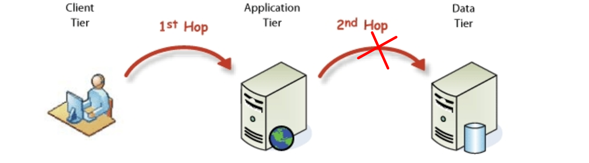
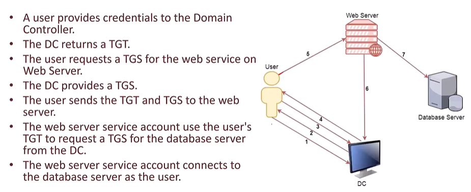

## Introduction
<p style="text-align: justify;">
The <b>double-hop problem</b> emerged in the early 2000s as applications required seamless user authentication across multiple services. On the following image we can visualise the problem as the user accesses the first hop, but by default, the service cannot access the second hop on behalf of the user.</p>


<p style="text-align: justify;">
To address this, Microsoft introduced Kerberos delegation in Windows Server 2003, enabling trusted accounts (service or computer account) to act on behalf of other users to access other services. The classic senarios of why delegation is needed is when a user authenticates to a web server, using Kerberos or other protocols, and the server wants to nicely integrate with a SQL backend. Unconstrained delegation is one of the three ways to configure Kerberos delegation and was the first to be introduced in 2003. In Unconstrained delegation an account with the <b>TrustedForDelegation</b> attribute is allowed to impersonate any user—except those in <em>Protected Users</em> group or marked as <em>Account is sensitive and cannot be delegated</em> to access other services on thier behalf. You can find in references section some good articles for deep explanation....</p>

<p style="text-align: justify;">
The following diagram shows at tickets level how praticaly the first hop (web server) manages to impersonate users to access the second hop (database server) on thier behalf.
</p>



## What can go wrong with unconstrained delegation ?
<p style="text-align: justify;">
Now, the double-hop problem has been solved, right? Yes, but why are we still talking about it? Well, while it's true that "a service can impersonate users to access other services," the solution itself has opened up an entirely new attack surface.
</p>

<p style="text-align: justify;">
From the previous diagram showing how Kerberos tickets allow impersonation, we can see that when a user authenticates to a service with unconstrained delegation enabled, their Kerberos ticket-granting ticket (TGT) is stored in memory. If the first hop is compromised, all other services in the forest are at risk. An attacker can monitor the first hop, wait for a privileged user to connect, and then use their ticket to access other services in the forest, potentially compromising the entire domain.
</p>

## Exploitation MindMap


<p style="text-align: justify;">
The previous exploitation mind map from thehacker.recipes is a valuable resource that helps track possible attack paths based on the situation we have in hand. To practice all of this, I have set up a lab where I will showcase the enumeration and exploitation of various scenarios. For the lab i got a parent dc (dp-parentdc.dp.local), a child dc (dp-childc.child.dp.local), a server in the child (dp-srv01.child.dp.local) and 3 main users (robb.stark, ldap.svc, mssql.svc) 
</p>

<p style="text-align: justify;">
We will assume that user robb.start is already compromised and the services accounts (ldap.svc and mssql.svc) have weak password and can be kerberoasted... 
</p>

## Kerberos Unconstrained Delegation (KUD) Exploitation
<p style="text-align: justify;">
Before we start we need to which account have the TrustedForDelegation attribute (indicating the are allowed to delegate other users to any service).
</p>

### Powershell Enumeration
```powershell
Get-ADUser -Filter * -Properties TrustedForDelegation | Where-Object {$_.TrustedForDelegation -eq $true} | Select-Object Name, SamAccountName 

Get-DomainUser -Unconstrained

Get-DomainComputer -Unconstrained
```
### Enumeration with Impacket
```sh
impacket-findDelegation "child.dp.local"/"robb.stark":'P@ssw0rd123!'
```
### Abusing a Machine account with "TrustedForDelegation" 
<p style="text-align: justify;">
Before we start we need to which account have the TrustedForDelegation attribute (indicating the are allowed to delegate other users to any service).
</p>

### Abusing a User account with "TrustedForDelegation" 
<p style="text-align: justify;">
Before we start we need to which account have the TrustedForDelegation attribute (indicating the are allowed to delegate other users to any service).
</p>

### Case1: user has spn with no valid dns record
<p style="text-align: justify;">
Before we start we need to which account have the TrustedForDelegation attribute (indicating the are allowed to delegate other users to any service).
</p>

### Case2: we can add an spn 
<p style="text-align: justify;">
Before we start we need to which account have the TrustedForDelegation attribute (indicating the are allowed to delegate other users to any service).
</p>


## References
[d-hop problem101](https://book.hacktricks.xyz/windows-hardening/active-directory-methodology/kerberos-double-hop-problem)<br>
[d-hop problem102](https://techcommunity.microsoft.com/blog/askds/understanding-kerberos-double-hop/395463)<br>
[adsecurity](https://adsecurity.org/?p=1667)<br>
[thehacker.recipes](https://www.thehacker.recipes/ad/movement/kerberos/delegations/unconstrained)<br>
[stecterops](https://posts.specterops.io/hunting-in-active-directory-unconstrained-delegation-forests-trusts-71f2b33688e1)<br>
[ired team](https://www.ired.team/offensive-security-experiments/active-directory-kerberos-abuse/domain-compromise-via-unrestricted-kerberos-delegation)<br>
[hacktricks](https://book.hacktricks.xyz/windows-hardening/active-directory-methodology/unconstrained-delegation)<br>