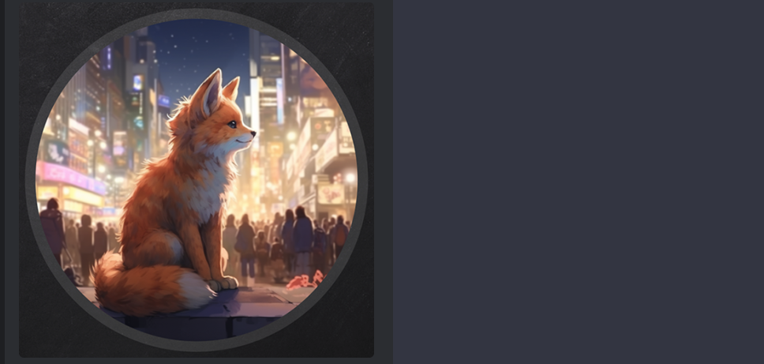

## Introduction
------------------------------------------------------------------------------------------
[baby2](https://www.vulnlab.com/machines) is an easy rated windows box from vulnlab. To get initial access we first clone a public gitea reposiory  which first commit leaks a gitea authorization key allowing us to access a private repository. Automatic deployment (some kind of CICD) is enabled for the private repositorie, and the deployment occurs over port 80. We can then push a shell.aspx file to the repos and get reverse shell visiting it on port 80. The privilege Escalation involve first decrypting mRemoteNG config file to get Gale.Dekarios password and second exploiting pdf24 (11.15.1) for CVE-2023-49147.

------------------------------------------------------------------------------------------


## Enumeration
We start by a full scan to discover all tcp opened ports...
### All Open Ports
```bash
rustscan -a 10.10.84.26
```


### Services Scanning
```bash
nmap -p80,445,3000,3389,5357,5985 -sC -sV -v -oN baby2.full baby2.vl
```
```text
# Nmap 7.94SVN scan initiated Sun Nov 24 17:55:00 2024 as: nmap -p80,445,3000,3389,5357,5985 -sC -sV -v -oN baby2.full baby2.vl
Nmap scan report for baby2.vl (10.10.84.26)
Host is up (0.051s latency).

PORT     STATE SERVICE       VERSION
80/tcp   open  http          Microsoft IIS httpd 10.0
|_http-server-header: Microsoft-IIS/10.0
| http-methods: 
|   Supported Methods: OPTIONS TRACE GET HEAD POST
|_  Potentially risky methods: TRACE
|_http-title: baby2 - Index
|_http-favicon: Unknown favicon MD5: FED84E16B6CCFE88EE7FFAAE5DFEFD34
445/tcp  open  microsoft-ds?
3000/tcp open  ppp?
| fingerprint-strings: 
|   GenericLines, Help, RTSPRequest: 
|     HTTP/1.1 400 Bad Request
|     Content-Type: text/plain; charset=utf-8
|     Connection: close
|     Request
|   GetRequest: 
|     HTTP/1.0 200 OK
|     Cache-Control: max-age=0, private, must-revalidate, no-transform
|     Content-Type: text/html; charset=utf-8
|     Set-Cookie: i_like_gitea=b965503876d81b1c; Path=/; HttpOnly; SameSite=Lax
|     Set-Cookie: _csrf=mJNYpuSqUQIKVkKKDZ5dI6XKhWU6MTczMjQ2NzMwNjQ2OTM4NTUwMA; Path=/; Max-Age=86400; HttpOnly; SameSite=Lax
|     X-Frame-Options: SAMEORIGIN
|     Date: Sun, 24 Nov 2024 16:55:06 GMT
|     <!DOCTYPE html>
|     <html lang="en-US" class="theme-auto">
|     <head>
|     <meta name="viewport" content="width=device-width, initial-scale=1">
|     <title>Gitea: Git with a cup of tea</title>
|     <link rel="manifest" href="data:application/json;base64,eyJuYW1lIjoiR2l0ZWE6IEdpdCB3aXRoIGEgY3VwIG9mIHRlYSIsInNob3J0X25hbWUiOiJHaXRlYTogR2l0IHdpdGggYSBjdXAgb2YgdGVhIiwic3RhcnRfdXJsIjoiaHR0cDovL2xvY2FsaG9zdDozMDAwLyIsImljb25zIjpbeyJzcmMiOiJodHRwOi8vbG9jYWxob3N0OjMwMDAvYXNzZXRzL2ltZy9sb2dvLnBuZyIsInR5cGUiOiJpbWFnZS9wbmciLCJzaXplcyI6IjU
|   HTTPOptions: 
|     HTTP/1.0 405 Method Not Allowed
|     Allow: HEAD
|     Allow: GET
|     Cache-Control: max-age=0, private, must-revalidate, no-transform
|     Set-Cookie: i_like_gitea=7d4bc46705756144; Path=/; HttpOnly; SameSite=Lax
|     Set-Cookie: _csrf=SH2gMnJyXmvRroy72O1upcIQgrc6MTczMjQ2NzMxMTgwNzIzMDcwMA; Path=/; Max-Age=86400; HttpOnly; SameSite=Lax
|     X-Frame-Options: SAMEORIGIN
|     Date: Sun, 24 Nov 2024 16:55:11 GMT
|_    Content-Length: 0
3389/tcp open  ms-wbt-server Microsoft Terminal Services
| ssl-cert: Subject: commonName=baby2
| Issuer: commonName=baby2
| Public Key type: rsa
| Public Key bits: 2048
| Signature Algorithm: sha256WithRSAEncryption
| Not valid before: 2024-11-23T16:24:27
| Not valid after:  2025-05-25T16:24:27
| MD5:   0930:c083:9f5b:8c59:4d9a:e960:2c27:e69a
|_SHA-1: 5a31:f527:a779:7ea8:4b4b:b406:3911:7bf0:d800:203b
|_ssl-date: 2024-11-24T16:57:09+00:00; -1s from scanner time.
| rdp-ntlm-info: 
|   Target_Name: baby2
|   NetBIOS_Domain_Name: baby2
|   NetBIOS_Computer_Name: baby2
|   DNS_Domain_Name: baby2
|   DNS_Computer_Name: baby2
|   Product_Version: 10.0.20348
|_  System_Time: 2024-11-24T16:56:29+00:00
5357/tcp open  http          Microsoft HTTPAPI httpd 2.0 (SSDP/UPnP)
|_http-title: Service Unavailable
|_http-server-header: Microsoft-HTTPAPI/2.0
5985/tcp open  http          Microsoft HTTPAPI httpd 2.0 (SSDP/UPnP)
|_http-server-header: Microsoft-HTTPAPI/2.0
|_http-title: Not Found
1 service unrecognized despite returning data. If you know the service/version, please submit the following fingerprint at https://nmap.org/cgi-bin/submit.cgi?new-service :
SF-Port3000-TCP:V=7.94SVN%I=7%D=11/24%Time=67435A6B%P=x86_64-pc-linux-gnu%
SF:r(GenericLines,67,"HTTP/1\.1\x20400\x20Bad\x20Request\r\nContent-Type:\
SF:x20text/plain;\x20charset=utf-8\r\nConnection:\x20close\r\n\r\n400\x20B
SF:ad\x20Request")%r(GetRequest,2E58,"HTTP/1\.0\x20200\x20OK\r\nCache-Cont
SF:rol:\x20max-age=0,\x20private,\x20must-revalidate,\x20no-transform\r\nC
SF:ontent-Type:\x20text/html;\x20charset=utf-8\r\nSet-Cookie:\x20i_like_gi
SF:tea=b965503876d81b1c;\x20Path=/;\x20HttpOnly;\x20SameSite=Lax\r\nSet-Co
SF:okie:\x20_csrf=mJNYpuSqUQIKVkKKDZ5dI6XKhWU6MTczMjQ2NzMwNjQ2OTM4NTUwMA;\
SF:x20Path=/;\x20Max-Age=86400;\x20HttpOnly;\x20SameSite=Lax\r\nX-Frame-Op
SF:tions:\x20SAMEORIGIN\r\nDate:\x20Sun,\x2024\x20Nov\x202024\x2016:55:06\
SF:x20GMT\r\n\r\n<!DOCTYPE\x20html>\n<html\x20lang=\"en-US\"\x20class=\"th
SF:eme-auto\">\n<head>\n\t<meta\x20name=\"viewport\"\x20content=\"width=de
SF:vice-width,\x20initial-scale=1\">\n\t<title>Gitea:\x20Git\x20with\x20a\
SF:x20cup\x20of\x20tea</title>\n\t<link\x20rel=\"manifest\"\x20href=\"data
SF::application/json;base64,eyJuYW1lIjoiR2l0ZWE6IEdpdCB3aXRoIGEgY3VwIG9mIH
SF:RlYSIsInNob3J0X25hbWUiOiJHaXRlYTogR2l0IHdpdGggYSBjdXAgb2YgdGVhIiwic3Rhc
SF:nRfdXJsIjoiaHR0cDovL2xvY2FsaG9zdDozMDAwLyIsImljb25zIjpbeyJzcmMiOiJodHRw
SF:Oi8vbG9jYWxob3N0OjMwMDAvYXNzZXRzL2ltZy9sb2dvLnBuZyIsInR5cGUiOiJpbWFnZS9
SF:wbmciLCJzaXplcyI6IjU")%r(Help,67,"HTTP/1\.1\x20400\x20Bad\x20Request\r\
SF:nContent-Type:\x20text/plain;\x20charset=utf-8\r\nConnection:\x20close\
SF:r\n\r\n400\x20Bad\x20Request")%r(HTTPOptions,197,"HTTP/1\.0\x20405\x20M
SF:ethod\x20Not\x20Allowed\r\nAllow:\x20HEAD\r\nAllow:\x20GET\r\nCache-Con
SF:trol:\x20max-age=0,\x20private,\x20must-revalidate,\x20no-transform\r\n
SF:Set-Cookie:\x20i_like_gitea=7d4bc46705756144;\x20Path=/;\x20HttpOnly;\x
SF:20SameSite=Lax\r\nSet-Cookie:\x20_csrf=SH2gMnJyXmvRroy72O1upcIQgrc6MTcz
SF:MjQ2NzMxMTgwNzIzMDcwMA;\x20Path=/;\x20Max-Age=86400;\x20HttpOnly;\x20Sa
SF:meSite=Lax\r\nX-Frame-Options:\x20SAMEORIGIN\r\nDate:\x20Sun,\x2024\x20
SF:Nov\x202024\x2016:55:11\x20GMT\r\nContent-Length:\x200\r\n\r\n")%r(RTSP
SF:Request,67,"HTTP/1\.1\x20400\x20Bad\x20Request\r\nContent-Type:\x20text
SF:/plain;\x20charset=utf-8\r\nConnection:\x20close\r\n\r\n400\x20Bad\x20R
SF:equest");
Service Info: OS: Windows; CPE: cpe:/o:microsoft:windows

Host script results:
| smb2-security-mode: 
|   3:1:1: 
|_    Message signing enabled but not required
| smb2-time: 
|   date: 2024-11-24T16:56:30
|_  start_date: N/A
|_cbaby2-skew: mean: -1s, deviation: 0s, median: -1s

Read data files from: /usr/bin/../share/nmap
Service detection performed. Please report any incorrect results at https://nmap.org/submit/ .
# Nmap done at Sun Nov 24 17:57:11 2024 -- 1 IP address (1 host up) scanned in 130.96 seconds
```
### Hostname
```bash
echo '10.10.84.26  baby2.vl dc.baby2'  >> /etc/hosts
```

## Foothold


## Privilege Escalation


## Kill Chain Summary


## References
