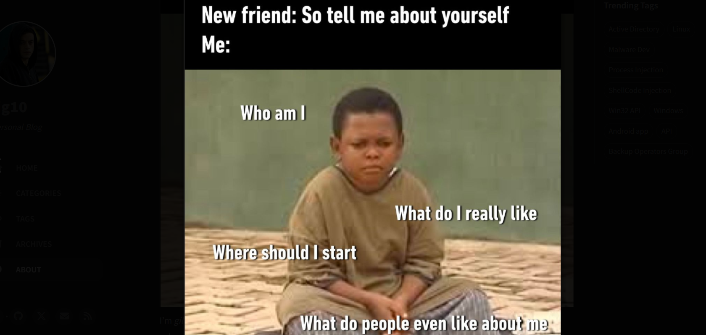

---
# the default layout is 'page'
icon: fas fa-info-circle
order: 4
---

## WhoAmI
 

I'm <em>gilles karougbe</em>, a cybersecutity enthusiast and fresh graduate as information security and cybersecurity state engineer. I'm always looking for ways to sharpen my hacking skills to better contribute to the filed. I have started this blog to document my journey, share my ctf walkthroughs and my  thoughts. My goal is to continuously learn, improve and grow. I'm not an expert (at least not yet hahaha...), if you find some gaps in my  knowledge just make sure you teaches me on your way—I'm probaly not aware of them. I hope this blog becomes a valuable resource for others on a similar path.

This Blog will be more about Web apps security, Active Directory, Android Hacking, Malware Dev, Frida, Defense evasion on the road toward Red Teaming ops...
 

## Education
- [2020-2024] CyberSecurity State Engineer  (National School of Applied Science Oujda, Morocco) 
- [2017-2019] High School  (Scientific High School Lomé, Togo)
  

## Skills
- Networking: TCP/IP, Switching, Routing, Cisco solutions.
- Programing: C, Python, JavaScript, PowerShell, Bash.
- Web apps pentesting: Owasp Top 10, APIs Testing, Fuzzing, Burpsuite, Postman.
- Active Directory Pentesting: FootHold, Attack Paths Management, Persistence Techniques. 
- Android Pentesting: Reverse Enginering, Instrumentation with Frida.
- Red Teaming: Malware Dev, AV Evasion.

## Certifications 
- [Certified Red Team Professional (CRTP)](https://api.accredible.com/v1/auth/invite?code=2eedd227c5af9d01a80a&credential_id=e2af0bb8-9e80-4c4b-83ce-0b7a6e80e77b&url=https%3A%2F%2Fwww.credential.net%2Fe2af0bb8-9e80-4c4b-83ce-0b7a6e80e77b&ident=15b3aa12-191c-40aa-b673-ad9e0161253e)
- [HackTheBox Dante Prolab](../assets/img/certificate/Dante.pdf)
- [Pratical Ethical Hacking (PEH)](../assets/img/certificate/peh.pdf)
- [Frida Labs](../assets/img/certificate/mhl-fridalabs.pdf)
- [Tryhackme Comptia Pentest+](../assets/img/certificate/THM-pentest+.png)
- [Tryhackme Jr Pentesting](../assets/img/certificate/THM-jrpentester.png)

## Some Projects
1. insecure deserialization poc
[nodeserialize lab](https://github.com/gil01karougbe/nodeserialize-poc)[php deserialization lab](https://github.com/gil01karougbe/phpserialization-poc)

2. jwt hacking poc
[jwt hacking lab](https://github.com/gil01karougbe/jwthacking-poc)

3. smbsharesdumper
[smbsharesdumper](https://github.com/gil01karougbe/smbsharesdumper)

4. ldapad
[ldapad](https://github.com/gil01karougbe/nodeserialize-poc)

5. myadlab
[my ad lab](https://github.com/gil01karougbe/myadlab)

6. frida for all the things
[fridaforallthethings](https://github.com/gil01karougbe/FridaScriptsForAllTheThings)

7. neth4ack
[jwt hacking lab](https://github.com/gil01karougbe/netHack)

## CTF Profiles
- [HackTheBox](https://app.hackthebox.com/profile/983770)
- [TryHackme](https://tryhackme-badges.s3.amazonaws.com/gil01Karougbe.png)

## Social Medias 
- [LinKedin](https://ma.linkedin.com/in/essognim-gilles-karougbe-015979223)
- [Twitter](https://x.com/01karougbe)

